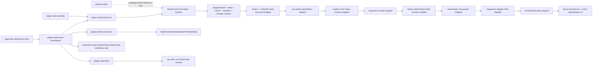

# SYSTEM_ARCHITECTURE.md — 系统宪法

> 本文档定义 XAI_Desktop 的架构约束与编码红线。
> 所有开发（人类和 AI）必须遵守此文档中的规则。
>
> 最后更新: 2026-05-24

> **Priority Note (2026-05-24):** §3-§10 below were authored for the **macOS Desktop surface (P1, currently paused per Web P0 Priority Override)**. The active P0 surface is the Web Console — see §12 below for web-side boundary, and `CLAUDE.md` "Current Priority" for the full priority order. Sections §1-§11 remain authoritative for P1/P2 Desktop work but MUST NOT be enforced verbatim against `packages/{xai-web-*, plugin-web-*}/`. Full Surface Scope Matrix to be authored in ADR-0009 (Web → Desktop Pivot Plan).

---

## 1. 架构流派

- **前端:** 微内核 (Microkernel) — Host 壳 + Plugin 业务层
- **Rust:** 模块化命令 + macOS 平台适配层
- **通信:** Plugin 间通过 Tauri 事件系统或 `@repo/core/events`，禁止直接 import 内部模块

## 2. 技术栈版本锁定

| 技术 | 版本 | 备注 |
|------|------|------|
| Tauri | 2.x | macOS private API 启用 |
| React | 19.x | 函数式组件 + Hooks |
| TypeScript | 5.x | strict mode |
| Vite | 7.x | 前端构建 |
| Rust | 1.80+ | Tauri 后端 |
| pnpm | 9.x | 包管理 |
| Turborepo | 2.6+ | Monorepo 编排 |

## 3. 三层边界规则

```
apps/desktop/src/     → Host 壳 (路由 + Provider + PluginHost 渲染，不含业务)
packages/core/        → 基础设施 (类型 + 事件 + Store + Registry，不含业务)
packages/plugin-*/    → 业务插件 (所有业务逻辑的唯一归宿)
packages/ui/          → 共享 UI (无业务逻辑的纯 UI 组件)
```

- **Host** (`apps/desktop/src/`): 窗口壳 + 路由 + 全局 Provider。禁止放业务逻辑
- **Plugin** (`packages/plugin-*/`): 业务功能自治单元。禁止跨 Plugin 直接 import 内部模块
- **Core** (`packages/core/`): 基础设施 + 共享类型。所有 Plugin 可依赖 Core
- **UI** (`packages/ui/`): 共享 UI 组件库。无业务逻辑

## 4. 编码红线

1. 禁止在 Host 写业务逻辑 → 业务代码必须在 plugin 包内
2. 禁止跨 Plugin 直接 import 对方 `src/` 内部模块
3. Plugin 间通信必须通过 `@repo/core/events` 的类型安全事件
4. 禁止在 Plugin 内直接调用 `@tauri-apps/api` → 通过 `@repo/core/hooks` 封装
5. 所有 Tauri 事件 payload 必须在 `@repo/core/types` 中定义类型
6. 每个 Plugin 的 `manifest.json` 是注册的唯一入口
7. 禁止使用 `console.log` 做生产日志 → 开发环境可用
8. 依赖方向严格单向: `Host → Plugin → Core/UI`，禁止反向
9. `index.ts` 是每个 Plugin 的唯一出口 → 外部只能从 `packages/plugin-*/src/index.ts` 导入
10. Plugin 内部目录结构自由组织 → `components/` `hooks/` `store/` `types/` 按需存在
11. UI 组件归属: 通用组件 → `packages/ui/`；业务组件 → plugin 内部
12. 禁止运行时动态插件加载 → 桌面应用编译时确定插件集，静态 import 注册

## 5. 多窗口架构

### 5.1 窗口分类

| 类型 | Label 模式 | 用途 | 交互模式 |
|------|-----------|------|---------|
| main | `main` | 全屏透明 overlay | 默认点击穿透 (`ignoresMouseEvents: YES`) |
| control | `control` | AI Cube 控制台 (360x360) | 始终可交互 |
| grid_\<id\> | `grid_xxx` | 独立 Grid 窗口 | 始终可交互 |
| widget_\<id\> | `widget_xxx` | Widget 窗口 | 始终可交互 (未来) |

### 5.2 macOS 窗口层级

所有窗口使用 `CGWindowLevelForKey(DesktopIconWindow)` 作为基准:

- **main 窗口:** `desktop_icon_level + 1`，始终 click-through
- **control 窗口:** `desktop_icon_level + 1`，可交互
- **grid 窗口:** `desktop_icon_level + 3`，可交互，置于 icon 之上

所有窗口加入 `NSWindowCollectionBehavior`: canJoinAllSpaces + stationary + ignoresCycle。

### 5.3 Pointer-Events 策略

- 根容器 `pointer-events: none` 实现桌面点击穿透
- 交互元素 (SmartContainer, AiCube, SettingsPanel) 显式设置 `pointer-events: auto`
- 每个 Grid 独立原生窗口，不受主窗口 pointer-events 限制

## 6. 跨窗口通信规则

- 所有事件通过 `@repo/core/events` 发送，payload 必须可序列化
- 事件命名: `<plugin>:<action>`，禁止使用 `window.postMessage`，禁止直接操作其他窗口的 DOM

### 6.1 事件前缀约定

| 前缀 | 归属 | 示例 |
|------|------|------|
| `app:` | 全局/Host | `app:interactive-mode-changed` |
| `organizer:` | plugin-organizer | `organizer:grid-update` |
| `todo:` | plugin-todo | `todo:item-completed` |
| `clipboard:` | plugin-clipboard | `clipboard:item-copied` |
| `widgets:` | plugin-widgets | `widgets:clock-tick` |
| `ai:` | plugin-ai-cube | `ai:query-response` |

## 7. 状态持久化

- 当前使用 localStorage，key: `xai-desktop-layout`
- 数据结构: `PersistedLayout { grids: GridBox[], items: DesktopItem[] }`
- 目标迁移到 Zustand + persist middleware
- 扩展 `GridBox` 字段时确保序列化兼容

## 8. DnD 系统

- 使用 `@dnd-kit/core`
- `GridItem` 为 draggable，容器为 droppable
- `moveItem` 函数处理跨容器拖拽，更新 `itemIds`
- 全局 DnD Provider 在 Host 层提供

## 9. Rust 后端模块结构

```
apps/desktop/src-tauri/src/
├── main.rs                # Tauri entry point
├── lib.rs                 # Builder 配置 — 注册 command 模块 + setup (<100 行)
├── commands/
│   ├── mod.rs             # 模块声明
│   └── window.rs          # create/update/close_grid_window
└── platform/
    ├── mod.rs
    └── macos/
        ├── mod.rs
        └── window_ext.rs  # NSWindow/CGWindowLevel/ignoresMouseEvents
```

- `lib.rs` 只做 builder 配置和模块注册，禁止放业务逻辑
- 按领域拆分 commands (window, fs, system)
- macOS 平台代码集中在 `platform/macos/`，用 `#[cfg(target_os = "macos")]` 隔离

## 10. 新建 Plugin 标准路径

```
1. 创建 packages/plugin-xxx/ (含 package.json, tsconfig.json, manifest.json)
2. 实现 src/index.ts + 业务组件/hooks
3. 创建 docs/ 四件套 (design.md, api.md, test.md, dev_log.md)
4. 在 apps/desktop/src/main.tsx 添加 import 注册
5. 更新 docs/PLUGIN_MAP.md 状态列
```

## 11. 明确排除项 (不做什么)

以下明确不在项目范围内（**对 P1 Desktop surface 而言**；Web P0 边界见 §12）：

- **不做运行时动态插件加载** — 编译时确定插件集
- **不做数据库迁移** — 当前用 localStorage，SQLite 是未来目标
- **不做 CI/CD** — 暂无 GitHub Actions

> **2026-05-24 删除条目：** 原 "不做 apps/web/ 和 apps/docs/ 清理 — 保留为 scaffold" 已删除——`apps/web/` 现在是 P0 active surface（24/24 SHIPPED），见 §12。

## 12. Web Console Boundary (P0, 2026-05-24)

Per `docs/workflow/roadmap/xai-web-console.md` §Authority Override (2026-05-23), the Web Console is the active product surface. Web boundary parallels but does NOT inherit §3-§10 verbatim — full Surface Scope Matrix is pending ADR-0009.

### 12.1 Web tri-layer

```
apps/web/                  → Vite SPA shell (host registration + providers + react-router)
packages/xai-web-*/        → 24 module packages + platform packages; registered via xai-web-shell slot pattern
packages/plugin-web-*/     → npm-namespace siblings of xai-web-* (same code, different package name)
```

### 12.2 Web persistence + events

- Persistence: `xai-web-persistence-contract` owns all `xai_*` localStorage keys (per DESIGN.md §9.2). Web packages MUST go through `usePref` / `setPref` / `removePref`.
- Events: `xai-web-event-bus` owns all `web:*` event keys. Cross-package web behavior MUST go through `emitWebEvent` / `onWebEvent` / `useWebEventListener`.
- Web packages MUST NOT import `@tauri-apps/api`; MUST NOT register on `core` PluginRegistry; MUST NOT depend on `apps/desktop/`.

### 12.3 Which §3-§10 rules apply to Web

- §3 三层边界 + §4 编码红线 #1/#2/#3/#8/#12 apply to both desktop and web (web's tri-layer being `apps/web` / `xai-web-*` / `core`).
- §4 #4/#5/#6 apply to desktop only — web replaces with persistence-contract + event-bus + manifest-optional shim pattern.
- §5/§6/§7/§9 are desktop-only.
- §10 新建 Plugin 标准路径 is desktop-only; web packages use a parallel template (full spec pending ADR-0009).

### 12.4 Web Project / Board module structure (2026-06-03)

The current Web Project surface is the `/app/board` route. It is implemented as
a board module family, not by the desktop `@repo/plugin-project` package.



Ownership rules:

- `plugin-web-board-core` owns the current Web board/list/card schema, Kanban
  rendering, drag flow, and `xai_boards_v2` / `xai_active_board` persistence.
- `plugin-web-board-views` owns alternate board projections: Table, Calendar,
  Dashboard, Timeline, and Map.
- `plugin-web-board-workspaces` owns the product shell around boards: switcher,
  creator, workspace chips, Inbox, Planner, filters, Board-card to Task link UI,
  per-board saved filter preference state, the explicit mock share modal, and
  responsive containment for the Board toolbar/detail shell.
- `plugin-web-board-core` also owns the Board export/import data contract:
  payload helpers that validate `xai_boards_v2`, preserve v1 storage envelopes,
  and project board/list/card logical entities.
- `plugin-web-board-core` owns Automation Lite preset evaluation. The active
  Web board calls that pure helper through `plugin-web-board-workspaces` for
  browser-local daily runs, manual reruns, and move-to-Done completion.
- `plugin-web-board-core` owns the Board integration adapter metadata contract:
  provider catalog, optional attachment source metadata, URL validation, and
  pure helper creation. Real third-party API sync remains outside this package.
- `plugin-web-board-workspaces` owns the card-detail integration link UI that
  writes provider-labeled links into existing `BoardCard.attachments[]`.
- `plugin-web-board-core` owns the Board comment/activity entry contract:
  `note | comment`, author metadata, pure creation helpers, and runtime guard
  validation.
- `plugin-web-board-workspaces` owns the visible card-detail Comments &
  Activity timeline. Mention notifications and realtime collaboration are
  future work.
- `@repo/plugin-web-tasks` owns the `xai_task_cols` shape and public board-link
  helper surface used to create deterministic linked tasks from Board cards.
- `@repo/plugin-web-calendar` may read `plugin-web-board-core` public storage
  helpers to render a read-only derived Board-card date feed. Calendar must not
  own or duplicate Board card storage.
- `@repo/plugin-project` remains the desktop/control Project capability package
  and parity reference; Web code must not import its internals until a dedicated
  Web runtime contract is accepted.
- Formal Project-module follow-up work is tracked in
  `docs/workflow/roadmap/xai-web-project-module.md`.
