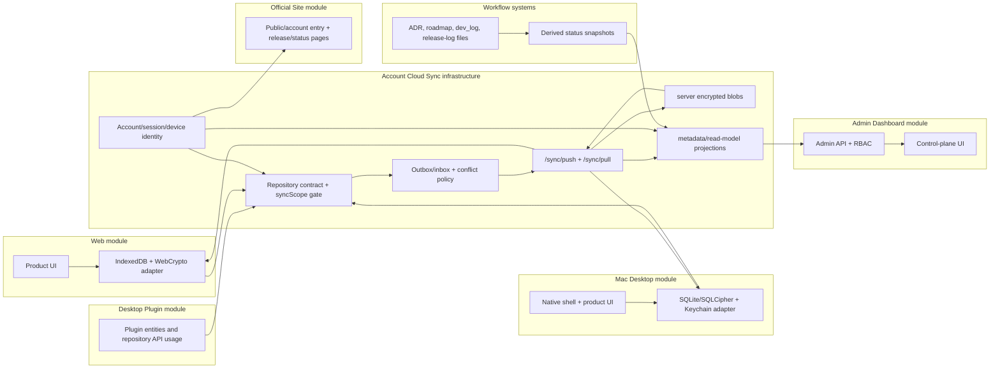

# Account Cloud Sync Architecture Charter

| Field | Value |
|---|---|
| Owner | `sync` product module |
| Status | Draft architecture charter |
| Branch lane | `codex/sync/<feature>` |
| Applies to | Web, Mac Desktop, Desktop Plugin, Site, Admin Dashboard, Workflow systems |
| Builds on | `CLAUDE.md`, `docs/PRODUCT_MODULE_MAP.md`, ADR-0013 D4, `docs/contracts/data-repository-v0.md`, `docs/TECHNICAL_REQUIREMENTS.md`, `docs/workflow/roadmap/sync-v1.md` |

## 1. Positioning

Account Cloud Sync is shared product infrastructure, not a standalone product
surface. It is the account, device, repository, outbox, push/pull, conflict,
encrypted-blob, metadata, and read-model layer consumed by the other product
modules.

It must provide one shared account and sync substrate for:

- Web product surfaces.
- Mac Desktop product surfaces.
- Desktop plugin data surfaces.
- Official Site account entry and release/status messaging.
- Admin Dashboard control-plane read models.
- Workflow systems that need derived status snapshots.

It must not create a seventh independent product state system, a separate UI
surface, or a direct Web-to-App bridge. ADR-0013 D4 remains the governing rule:
Web and App do not sync to each other. Both sync to one account cloud layer.

## 2. Source-of-truth hierarchy

When documents disagree, use this hierarchy until a newer ADR explicitly
supersedes it:

1. Product routing: `CLAUDE.md` and `docs/PRODUCT_MODULE_MAP.md` decide product
   module ownership, branch lane, and cross-module handoff.
2. Record contract: `docs/contracts/data-repository-v0.md` owns `RepoRecord`,
   `entityType`, `schemaVersion`, repository behavior, and `syncScope`.
3. Protocol and crypto: `docs/TECHNICAL_REQUIREMENTS.md` and the sync-v1 roadmap
   own `/sync/push`, `/sync/pull`, encrypted envelopes, nonce lease, HPKE,
   AES-256-GCM AAD, commit sequence, conflict shadow, and key lifecycle.
4. Surface ownership: Web, App, Plugin, Site, Admin, and Workflow own their local
   UI, local storage adapter, route, and operator workflow concerns.
5. Workflow truth: roadmap manifests, dev logs, release logs, and ADRs remain
   repository-truth. Sync/Admin may expose derived snapshots only.

This charter does not redefine `RepoRecord`, `syncScope`, or the sync-v1 crypto
protocol. It only fixes where Account Cloud Sync sits in the product
architecture and how other modules consume it.

## 3. Product topology



The key topology property is a hub-and-spoke sync model:

```text
Web IndexedDB <-> Sync API <-> server encrypted blobs <-> App SQLite/SQLCipher
                /sync/push,/sync/pull
```

Plugins do not own a sync engine. They declare and manipulate entities through
the repository contract. The sync layer decides whether a record enters the
remote path by reading `syncScope`.

## 4. Module relationship contract

| Module | Relationship to Account Cloud Sync | Must not do |
|---|---|---|
| Web | Uses the account/session state, browser repository driver, IndexedDB/WebCrypto local store, sync status, outbox/pull apply results, and conflict surfaces. | Must not sync directly to App, bypass repository drivers, or store raw key material in JS-visible state. |
| Mac Desktop | Uses account/device identity, SQLite/SQLCipher repository driver, Keychain-backed crypto handles, outbox/pull apply results, and native sync controls. | Must not treat Web as upstream, expose Keychain secrets to plugins, or send `device-local` records to remote outbox. |
| Desktop Plugin | Declares business entities and consumes repository APIs. It may opt an entity into `account-sync` only by satisfying D4 completeness gates. | Must not read SQLite/IndexedDB/Supabase directly or implement private push/pull logic. |
| Account Cloud Sync | Owns account-sync contracts, device identity, syncScope enforcement, encrypted blob movement, outbox/inbox semantics, conflict policy, cursors, and sync metadata. | Must not implement product-specific UI or override owning-module data semantics. |
| Official Site | Links users into account/session entry, downloads, release/status pages, and public sync/security explanations. | Must not host private product data, admin data, or internal sync control-plane state. |
| Admin Dashboard | Reads server-side account, device, usage, quota, audit, and sync-health read models through an Admin API guarded by RBAC. | Must not decrypt user payloads, expose service-role credentials, or read raw provider secrets in the browser. |
| Workflow systems | Keep repo-truth files as the source of execution state while optionally generating sync/admin status snapshots. | Must not let cloud sync replace ADRs, roadmap manifests, dev logs, or release logs as source of truth. |

## 5. Data classification

| Data class | Examples | Default authority | Cloud sync behavior |
|---|---|---|---|
| Account identity | account id, email, auth session metadata, admin claim metadata | Account/auth service | Server-authoritative metadata, not a `RepoRecord` payload. |
| Device identity | `device_id`, `encryption_device_id`, device public key, active/revoked status | Account Sync device registry | Server-visible metadata required for encrypted sync and revocation. |
| Product account-sync records | `organizer.grid`, `labels.label`, `productivity.todo`, `productivity.habit`, `project.board`, `project.card` | Owning plugin plus `@repo/core-data` contract | Sync only when the entity is registered and `syncScope: "account-sync"`. |
| Conditional mixed records | `organizer.item` with local path, app metadata, or file bookmarks | Owning plugin plus platform adapter | May become `device-local` when path permission, MAS sandbox, or privacy constraints require it. |
| Device-local records | `clipboard.item`, future `widgets.widget`, tray/window/drag state, runtime-only UI state | Local surface | Never enters remote outbox. |
| Secrets and key material | master password, secret key, KEK, DEK, device private key, provider raw keys | Local secure storage or server secret handle | Never plaintext-syncs. Browsers/Admin receive only handles/status where allowed. |
| Protocol metadata | mutation id, proposed revision, commit sequence, cursor, nonce lease, conflict shadow metadata | Sync protocol | Syncs as metadata needed for idempotency, ordering, and convergence. |
| Admin read models | users, orgs, billing/quota, AI usage, feature flags, audit summary, sync health | Admin/control-plane backend | Read through Admin API projections; no user payload plaintext. |
| Workflow state | roadmap rows, dev_log status, release logs, verification receipts | Repository files | Repository remains authoritative; cloud/admin snapshots are derived. |

## 6. Local-first boundaries

| Surface | Local-first store | Account-sync path | Local-only boundary |
|---|---|---|---|
| Web | IndexedDB/WebCrypto plus browser-safe preference storage | Repository driver -> outbox -> `/sync/push`; pull apply from `/sync/pull` | Service worker cache, local UI prefs, session-only keys, search indexes, raw refresh token visibility. |
| Mac Desktop | SQLite/SQLCipher, Keychain, Tauri crypto commands | Repository driver -> outbox -> `/sync/push`; pull apply from `/sync/pull` | Keychain material, native window state, file bookmarks unless promoted, local runtime telemetry. |
| Desktop Plugin | Repository interface only | Entity declares `syncScope`; repository/sync layer handles remote path | Direct DB access, direct Supabase access, widget/clipboard/device defaults. |
| Admin Dashboard | Server-side read-model store plus guarded browser state | Admin API reads projections emitted by account/sync/billing/audit services | Encrypted payload plaintext, service-role keys, provider secrets, user-local stores. |
| Official Site | Public build assets and account-entry links | Public status and auth entry only | Product records, sync payloads, admin records, internal workflow state. |
| Workflow systems | Git-tracked ADR/roadmap/dev_log/release files | Optional snapshot export into read models | User private data, raw local logs, secrets, mutable cloud-only workflow status. |

## 7. Web, App, and Plugin data boundaries

Web owns browser product interaction and the browser repository adapter. It may
surface sync status, conflicts, device status, and account settings, but it does
not own the encrypted-blob protocol or App convergence behavior.

Mac Desktop owns native runtime behavior, SQLCipher, Keychain, local permission
prompts, and native offline guarantees. It may surface the same account and sync
state through native UI, but it does not consume Web state directly.

Desktop Plugin owns entity intent and business rules. A plugin may define a
record as account-sync only after the D4 completeness checklist is satisfied:
entity type, schema version, local mapping, push format, pull apply rule,
conflict policy, Web IndexedDB test, App SQLite/outbox test, and two-device
smoke. A plugin cannot implement a separate transport path.

## 8. Admin Dashboard unified data source

Admin Dashboard gets a unified source through server-side read models fed by
account, sync, usage, quota, billing, AI governance, and workflow snapshot
events. It should read those projections through an Admin API with admin-claim
checks, RBAC, route denial tests, and append-only audit logs.

The Admin source is unified at the metadata and control-plane level, not by
decrypting user payloads. Admin may display:

- account and org membership state;
- device count, active/revoked status, and last sync health;
- aggregate sync metrics such as failures, retry counts, batch sizes, and
  latency;
- quota, billing, AI usage, and feature flag state;
- audit events and workflow/release snapshots.

Admin must not display encrypted user payload plaintext, raw entity payloads,
raw device identifiers where a hashed or scoped identifier is enough, provider
raw secrets, service-role credentials, DEK/KEK/device private key material, or
local-only records.

## 9. Future work routing

| Work item | Owning module and lane |
|---|---|
| Add or change account-sync entity, repository syncScope, outbox/pull, encrypted blob metadata, conflict, cursor, nonce, or device-sync contract | `sync`, `codex/sync/<feature>` |
| Add Web IndexedDB adapter, Web conflict UI, Web sync status UI, Web account UI | `web`, `codex/web/<feature>` |
| Add Tauri command, SQLCipher/Keychain native bridge, App local migration, App native sync UI | `app`, `codex/desktop/<feature>` after D3 classification |
| Add plugin business entity or plugin behavior | `plugin`, `codex/plugin/<feature>`; switch to `sync` only when remote sync contract changes |
| Add public marketing/account-entry/download/release-status page | `site`, `codex/site/<feature>` only after operator confirmation |
| Add Admin Dashboard control-plane UI/API/read model | `admin`, `codex/admin/<feature>` only after operator confirmation |
| Add workflow status snapshot, roadmap/dev_log/release-log projection, or automation evidence surface | Workflow docs/control-plane owner; repo files remain authoritative |

## 10. Verification gates

Any later runtime implementation that claims to consume this charter must pass
these gates:

- Routing gate: the work is classified into exactly one product module.
- Scope gate: `device-local` records cannot enter remote outbox or server
  encrypted blobs.
- Entity gate: `entityType`, `schemaVersion`, migration plan, local mappings,
  owner, and tests are present for any `account-sync` record.
- Protocol gate: `/sync/push`, `/sync/pull`, mutation idempotency, nonce lease,
  AAD, commit sequence, conflict shadow, and encrypted blob access follow the
  existing sync-v1 protocol.
- Store gate: Web IndexedDB/WebCrypto and App SQLite/SQLCipher behavior are both
  covered where a record is cross-device.
- Convergence gate: device A write -> account cloud -> device B pull/apply
  convergence is proven.
- Conflict gate: conflicts are flagged or resolved by an explicit merge rule;
  silent last-write-wins is not accepted.
- Admin gate: RBAC, route denial, no-secret browser bundle, and audit append are
  proven before control-plane data is exposed.
- Site gate: public pages expose only public/account-entry/status information.
- Workflow gate: generated status never replaces ADR, roadmap, dev_log, or
  release-log files as source of truth.

## 11. Non-goals for this charter

- No runtime sync-v1 implementation is unpaused by this document.
- No new product UI is authorized by this document.
- No `site` or `admin` implementation branch is authorized by this document.
- No `RepoRecord`, `syncScope`, or sync-v1 crypto protocol change is introduced.
- No Web-to-App direct sync path is introduced.
