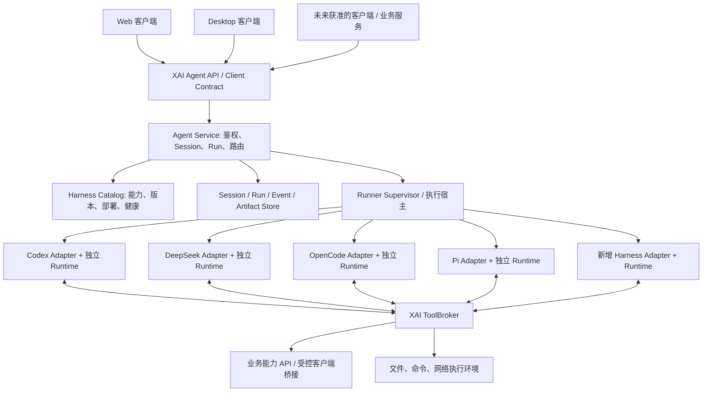

# XAI 多 Harness 后台执行基座：动机、架构评估与实施提案

> 状态：DRAFT / 待 Claude Code 独立审查。用户目标已确认，技术选型与实施方案尚未批准。
> 创建日期：2026-09-09（America/Los_Angeles）。作者：Codex。
> 本轮交付：设计文档及审查 prompt；不部署服务、不安装 Harness、不修改产品运行时代码。
> 主模块归属：`web`，从现有 Web AI 能力进入共享基础设施规划；影响 `app`、`plugin`、`admin`，持久化变化另做 `syncScope` 分类。
> 这里的“后台”指自主管理的服务端执行环境，不是 Admin Dashboard 页面，也不是本机开发助手的后台会话。

## 1. 阅读方法与事实边界

本文件是把用户出发点、前置审查、最新澄清及修订方案放在一起的设计记录，不是已经实现的架构说明。

| 标签 | 含义 |
| --- | --- |
| USER-CONFIRMED | 用户明确提出的方向；优化方案不得悄悄缩减这些目标 |
| OBSERVED | 在指定提交上读取源码或配置得到的事实 |
| HISTORICAL | 上一轮证据；不能当作当前提交的验证结果 |
| PROPOSED | 本文件建议；允许审查者提出替代方案 |
| OPEN | 尚需决策、验证或补充环境资料 |

证据基线：

- 原始审查：`9257be40c03216b1006691bfa289bd29d6dfe839`，2026-09-08 的 Web 主线快照。
- 本次源码复核：`c604951acda9adb48c51e00dba6255757b1f2afc`，来自 `codex/web/full-product-audit-20260908` 的已提交快照。
- 文档分支：`codex/web/agent-harness-foundation-design-20260909`，从本次复核提交创建。该分支继承审查分支历史，不代表这些历史变化已经合入 `web`。单独整合设计时应只取本次文档提交。
- 独立 worktree 隔离了共享工作目录中其他任务的未提交修改；那些文件未纳入本次交付。
- 上游资料在上一轮于 2026-09-08 读取；本轮以该资料为研究基线。实现前须重新核对官方文档、发行版本、源码 revision、协议 schema 和许可证。没有锁定上游版本，也没有四套 Harness 的真实运行结果。
- 原始测试证据：AI Chat 253 项、任务 AI 订阅 15 项、日历 AI 订阅 11 项通过，AI Chat 类型检查通过；有 React `act(...)` 警告。这 279 项结果仅属于原始审查，不是 `c604951` 的复跑结果。
- 本次为文档改动，仅做文档一致性、链接、Git 范围检查；不把 package 内历史日志的 PASS 自动升级为独立验证或生产可用。

审查入口：[Claude Code 审查 prompt](CLAUDE_REVIEW_PROMPT.md)。

## 2. 用户出发点、目的和动机

### 2.1 原始需求的核心表达

用户希望后续接入几套开源 Agent Harness System，先在后台统一集成，并可在不同系统之间切换，前端用户基本无感。四个重点方向是：

1. Codex：研究成熟 coding agent 的核心实现方式。
2. DeepSeek Harness：研究 plugin-first Harness 架构。
3. OpenCode：研究 multi-provider agent 的实现方式。
4. Pi：研究 minimal、可嵌入、可扩展的 agent runtime。

用户要求先审查当前 Agent、模型调用、工具调用、任务执行和状态管理架构，判断统一接口的必要性、可复用部分、调整范围及实施顺序。原始范围是架构审查和方案设计，不直接大规模修改代码。

### 2.2 2026-09-09 的关键澄清（USER-CONFIRMED）

用户进一步明确：“希望这几个架构都能够部署在我的这个后台上面”，“相当于我的一切平台的基座”，“必须先让它们在上面跑，能够独立跑通”，“后续可能还有新的架构可以加进来”。

由此冻结以下目标：

- 四套系统均是实际后台部署与独立验证的目标，不只是阅读源码后任选一个。
- 后台要能在不依赖 XAI 聊天页面、浏览器标签页和桌面 UI 的情况下驱动各 Harness。
- 它们服务于 XAI 各个平台及后续 Agent 驱动的功能开发，不能把方案限制为当前聊天组件的模型开关。
- 需要时能够选择、切换执行引擎；切换尽可能不影响前端交互和上层业务契约。
- 后续第五、第六套 Harness 应能通过明确扩展边界加入，不要求重写所有平台功能。
- 实施顺序必须体现：先独立跑通后台运行时，再统一接入、切换和业务集成。
- 本次要求形成非常详细的文档并 commit，同时给 Claude Code 一份用于审查、分析和优化的 prompt。

“一切平台的基座”在本提案中的解释是：共用 Agent 执行能力与治理边界。普通 CRUD、日历计算、鉴权、支付等确定性业务服务仍由业务层负责；没有理由让每次业务操作都先经过 LLM。

“支持后续功能开发”同时覆盖两个可能场景：产品内部智能功能、受控工程任务（编码/分析/产物生成）。二者共享运行契约，但权限和工作空间隔离，具体首批场景仍为 OPEN。

### 2.3 动机与预期收益

| 动机 | 对架构的要求 | 成功表现 |
| --- | --- | --- |
| 避免被一个 Harness 锁定 | 平台掌握外部契约、业务工具、逻辑会话与路由 | 更换引擎不要求重写 UI 和业务模块 |
| 利用不同系统的优势 | 每个原生 runtime 保留自己的内部实现 | 不强迫所有系统退化成相同提示词和同一循环 |
| 统一服务多平台 | 后台 API 与运行生命周期不依赖某个客户端 | Web、桌面和未来获准的平台可消费同一契约 |
| 先验证可运行性 | 每套系统有部署清单和独立 smoke 证据 | 脱离 XAI UI 也能完成实际任务 |
| 持续扩展 | 注册、能力协商、版本隔离及兼容测试 | 新引擎通过 Adapter 加入，旧引擎继续可用 |
| 控制重构成本 | 包装现有能力，按场景逐步迁移 | 已交付功能继续工作，可单独回退 |

### 2.4 尚未确认的目标解释

这些不能由架构文档代替用户决定：生产服务器所在地/供应商/OS/CPU 架构；首批用户与租户模式；是否首先开放 shell；任务时长和并发；预算；BYOK 与平台付费凭据策略；本地文件是否可上传到远端；哪些平台先接入。

可以先采用可替换的开发环境假设推进设计，但不能把假设写成用户承诺或部署事实。

## 3. 术语与必须分离的层次

| 术语 | 本提案中的定义 |
| --- | --- |
| Model Provider | 提供模型推理 API 的服务；例如选择 DeepSeek 模型不等于使用 DeepSeek Harness |
| Harness | 驱动模型、上下文、工具和执行循环的 Agent 系统 |
| Harness Deployment | 后台某个可运行实例，绑定 runtime、版本、镜像/二进制、配置和环境 |
| Harness Adapter | XAI 契约与原生 SDK/协议之间的转换器 |
| Agent Service | XAI 拥有的会话、运行准入、路由、事件与状态服务 |
| Execution Host / Runner | 实际启动、监督、取消和隔离 runtime/进程的执行宿主 |
| ToolBroker | 统一业务工具入口，负责输入、权限、审批、幂等及结果 |
| XAI Session | 面向用户与平台的稳定逻辑会话，不等同于某家原生会话 |
| Run | 一次执行请求及其生命周期；不与任务列表里的业务 Task 混用 |
| Step | XAI 定义的运行内阶段；各家原生 turn/step 语义必须显式映射 |
| Artifact | 可引用、可授权访问的产物，如文件、diff、报告；不是任意本地绝对路径 |
| Product Plugin | XAI 的 UI/业务插件、widget、原生平台能力 |
| Harness Plugin | 某引擎自己的扩展模块；与 Product Plugin 不存在天然一一对应 |

`.agents/`、`.codex/agents/`、Workflow V2 等是开发本项目的协作机制，不是产品提供给终端用户的运行平台。本提案不修改它们的协议。

## 4. 当前仓库架构评估

### 4.1 原始主链路与可复用资产

```text
AiChatModule
  → 浏览器内队列 / 确认流程
  → streamCompleteChat
  → resolveProvider + 密钥读取 + Context 构造
  → Anthropic / OpenAI-compatible HTTP API
  → SSE 解析 → 文本 / 单个 toolUse
  → 任务 / 日历业务事件 → 所属模块 reducer → 本地数据
```

| 层 | 现有资产 | 复用判断 | 尚不能等同于 |
| --- | --- | --- | --- |
| 模型适配 | provider preset、请求序列化、SSE、错误分类、AbortSignal | 可以保留在 Builtin 路径，逐步改为注入配置 | 可部署的通用 Harness |
| 工具定义 | 六个任务/日历创建、更新、删除工具及确认描述 | 保留领域意义，改进统一定义 | 任意后端 plugin 体系 |
| 领域执行 | 任务与日历内部 reducer、数据验证 | 保持业务模块所有权 | 后台已可直接调用的业务 API |
| UI | 会话列表、消息流、确认卡片、错误提示 | 尽量保留，用投影适配统一事件 | 后台运行状态事实源 |
| Context | 今日任务、日历、专注、习惯快照 | 抽离数据源并增加预算和来源 | 全面的 context/session manager |
| 存储 | 偏好存储、账号边界；core-data 的 Repository 契约 | 分层评估，不全量迁移 | 持久运行队列或分布式事务 |
| 产品插件 | core Registry、UI slot、类型化事件 | 保留组合方式 | 安全装载任意 Harness 插件 |
| 桌面 | Tauri 宿主、数据/Keychain 边界、共享 Web 方向 | 后续作为客户端/执行宿主扩展参考 | 本轮授权新增的本地 daemon |
| 控制面 | Admin provider、quota、audit 等规划 | 未来配置面遵循既有 roadmap | 已上线的多租户 Agent 控制面 |

### 4.2 原始发现与本次状态修订

**不能原样复制上一轮结论。** `9257be4` 到 `c604951` 之间已经出现实际修复。

| 原始发现（HISTORICAL） | 本次复核（OBSERVED） | 对新方案的影响 |
| --- | --- | --- |
| 确认后发事件就报告成功 | `handleConfirm` 已 await `requestToolWrite`；失败保留错误状态，成功后才继续模型回复 | 不再提出“从零增加业务回执”；应复用并扩展当前语义 |
| subscriber 的去重只有内存 seen-set | 任务创建已用 `commitCanonicalCommand`；业务 data 和 receipt 同一个 envelope 写入，签名冲突可拒绝，已有 replay 分支 | 不再称当前完全没有持久幂等；后台扩展仍需明确事务边界和外部副作用 |
| BYOK 密钥以 provider 行存储 | `secretStore` 已有账号/代际相关隔离与迁移处理，聊天也增加 owner 检查 | 新服务端密钥方案要保留账号边界，不能退回全局共享 key |
| 会话存储恢复简单 | 新增 `useConversationRecovery`、`useChatPreference`，涉及保存失败与恢复 | 复用既有恢复行为；不要改成断线就丢草稿 |
| 普通请求没有完整历史 | `processQueue` 仍只传本次 text；adapter 默认单条用户消息 | 仍需中立 transcript 与模型历史构造 |
| 循环、审批依附 React | 队列、待确认、控制器仍由组件持有 | 独立后台执行仍未实现 |
| 单工具、有限往返 | 输出仍是单个 `toolUse`，后续确认回复有界 | 必须和一般 Agent Run 的生命周期区分 |

当前新增代码有 activation、账号 generation/epoch、浏览器锁和本地存储条件。源码存在不表示所有运行环境均已启用、完成独立验证或生产发布。尤其本次没有重跑 REL-03 联合验证，不对其整体发布状态作新结论。

### 4.3 源码导航与证据

以下链接相对仓库，可随文档跨电脑迁移。Claude 审查时须记录当时 HEAD，并以符号检索为主，避免把旧行号当成当前定位。

| 证据 | 需要检查的符号/行为 |
| --- | --- |
| [AiChatModule](../../../packages/plugin-web-ai-chat/src/AiChatModule.tsx) | `processQueue`、`handleConfirm`、`pendingConfirmation`、owner 校验、卸载取消 |
| [stream adapter](../../../packages/plugin-web-ai-chat/src/internal/claudeStreamAdapter.ts) | `StreamRequest`、`StreamChunk`、`priorMessages`、单工具选择、配置注入耦合 |
| [model provider](../../../packages/plugin-web-ai-chat/src/internal/llmProvider.ts) | `resolveProvider`、`buildBody`、Anthropic 内容块到 OpenAI 的转换、endpoint allowlist |
| [tool registry](../../../packages/plugin-web-ai-chat/src/internal/toolRegistry.ts) | `AiToolDef`、`toConfirmation`、`toWriteEvent`、校验与六个工具 |
| [tool request receipt](../../../packages/plugin-web-ai-chat/src/internal/requestToolWrite.ts) | `attemptId`、request/channel/owner 匹配、1500ms 本地等待超时 |
| [canonical command](../../../packages/plugin-web-storage/src/internal/canonicalCommandState.ts) | `commitCanonicalCommand`、activation、签名、同记录 data/receipt、容量、锁、replay |
| [task subscriber](../../../packages/xai-web-tasks/src/internal/aiCreateSubscriber.ts) | 所属模块内调用 reducer、`targetId` 与错误返回 |
| [calendar subscriber](../../../packages/xai-web-calendar/src/internal/aiCreateSubscriber.ts) | 同类业务操作的真实验证边界 |
| [context provider](../../../packages/plugin-web-ai-chat/src/internal/contextProvider.ts) | `buildTodayContext`、top 20、日历/标题未形成硬 token 上限 |
| [message types](../../../packages/plugin-web-ai-chat/src/types.ts) | UI 消息与附件元数据尚不能代表完整执行日志 |
| [secret store](../../../packages/plugin-web-ai-chat/src/internal/secretStore.ts) | 浏览器凭据隔离、AAD、迁移；不是后端 secrets manager |
| [conversation recovery](../../../packages/plugin-web-ai-chat/src/internal/useConversationRecovery.ts) | 保存失败、恢复、账号切换行为 |
| [event bus](../../../packages/xai-web-event-bus/src/emitter.ts) | 页内 EventTarget；不能用作网络持久消息总线 |
| [core-data types](../../../packages/core-data/src/types.ts) | Repo/transaction/schemaVersion/syncScope 契约 |
| [AI Cube](../../../packages/plugin-ai-cube/src/hooks/useAiConversation.ts) | mockResponse、mock action；不误判为独立成熟 runtime |
| [部署配置](../../../apps/web/wrangler.toml) | 当前 Pages 静态构建产物，未提供长驻 Harness 进程部署 |
| [全局模块状态](../../PLUGIN_MAP.md) | 依赖稳定性；core-data/AI Cube 在本基线仍不可当作全部成熟 |

### 4.4 核心判断

当前存在“模型 API 适配 + UI 内有限工具流程”，并不存在满足用户目标的“后台多 Harness 执行平台”。统一边界现在有必要，但不必大规模改写现有业务。

仅把 `streamCompleteChat` 重命名为 `AgentAdapter.run` 无法解决：独立部署、进程故障、租户隔离、持久 Run、原生 session 映射、artifact、后台工具执行和版本升级。

仅部署四个 CLI 也不足以构成平台：它们还需要一致的准入、会话和事件契约、权限控制、运行证据与可用性声明。

## 5. 目标架构：统一入口、独立运行时、共享能力

### 5.1 逻辑架构（PROPOSED）



这是逻辑边界，不等于必须部署这么多微服务。首版允许一个 Agent API 服务、一个存储实例、一个 Runner Supervisor，再按 Harness 启动隔离子进程或容器。进程内 SDK 也应运行在后台受限 worker 中，而不是直接在 Web bundle 或高权限 API 主进程里执行任意插件。

### 5.2 控制面与执行面

- 控制面掌握：身份、租户、会话 ID、路由策略、已安装版本、可用能力、并发/预算准入、状态与审计。
- 执行面掌握：原生 Agent loop、模型调用、工作空间、原生状态、进程/容器生命周期。
- XAI 不接管每家的内部循环；Adapter 把原生执行映射成一致的外部语义。
- Admin Dashboard 是未来控制面的管理入口，不是执行服务本身。部署验证可以先用受保护 API/CLI，无需等待 Admin UI 全部完成。
- 每个 Run 绑定不可变执行配置快照，运行中切换默认 provider 或升级配置不得静默改变该 Run。

### 5.3 部署方式选择

| 候选 | 优点 | 约束 | 建议 |
| --- | --- | --- | --- |
| 每个 Harness 一个受控子进程 | 初始部署简单，可使用 stdio/SDK | 不是 OS 安全隔离，共享宿主风险仍在 | 仅受信任开发 smoke 可用；权限范围必须清楚 |
| 独立容器/worker | 版本和依赖隔离，可限制挂载及资源 | 要管理镜像、状态卷、退出和清理 | 优先评估为后台四套系统的部署基础 |
| VM/更强沙箱 | 适合不受信任代码及跨租户工作空间 | 成本和运维较高 | shell/第三方插件风险需要时引入 |
| 单进程加载所有框架 | 表面调用简单 | 故障、依赖、全局状态、插件权限容易相互污染 | 不作为默认架构 |
| 将 CLI 塞进现有静态站部署 | 可复用站点名字 | 现有部署并没有这些进程的运行边界 | 不能视为已经解决托管问题 |

暂不指定 Kubernetes、某个云厂商或数据库产品。先根据真实 OS、架构、持久磁盘、进程/容器能力和出网要求验证可行性。后台在 Linux 上运行和桌面 macOS 能力是两个执行域，不假设远程 Linux 可以操作用户本机文件。

## 6. 独立部署与独立跑通的定义

### 6.1 每套 Harness 都要具备的交付物

1. 来源 URL、锁定 release/tag/commit、许可证与依赖说明。
2. 可重建的部署清单、依赖版本、启动命令/镜像及回退方式。
3. 服务端配置 schema、names-only secret 模板、凭据获取边界。
4. 独立健康检查，区分进程存在、协议就绪、模型认证有效、实际任务可执行。
5. 不依赖 XAI UI 的启动、提交、观察、取消与清理脚本。
6. 隔离 workspace、原生状态目录和日志；不同实例不共享个人 HOME/登录态。
7. 实际模型任务 smoke；mock 仅证明协议和测试设施可工作。
8. 失败/超时/进程退出记录，确认不会把失败伪装成成功。
9. 产物与日志位置，原始凭据不写入回执或产物。
10. 按原生能力记录恢复支持；不支持的能力明确标为 unsupported。

“独立”表示可单独安装、启动、验证、停止或升级。并不要求四套永久同时占用资源，也不表示每套都得做独立的 UI 或重复建设认证平台。

### 6.2 第一批端到端场景

| 场景 | 证明什么 | 执行要求 |
| --- | --- | --- |
| 纯文本任务 | 原生运行时、认证、模型请求真实可用 | 保存输入、实际 engine/model、结果和退出状态 |
| 只读 fixture 分析 | Workspace 与 Context 输入成立 | 使用非敏感样例文件，确认目标环境 |
| 受控工具调用 | 工具请求/结果和审批边界成立 | 工具宿主独立于浏览器；不得靠 mock 文本冒充调用 |
| 生成小型产物 | 输出路径、内容和 artifact 引用成立 | 验证产物真实存在、内容可读、归属正确 |
| 主动取消与超时 | Run 与子进程生命周期可控 | 检查实际活动工具和遗留子进程，不只看 UI 状态 |
| 错误输入/坏配置 | 明确故障与恢复行为 | 记录错误类别，不输出 secret |
| 重启后查询/续接 | 持久状态和原生恢复能力 | 能查询终态是基础；原生续接单独能力测试 |

后台基础 smoke 可以由一个很小的受控工具宿主和临时业务 fixture 完成，不必先迁移任务/日历数据库，也无需先改聊天 React 组件。

### 6.3 初始验证矩阵

| Harness | 独立部署 | 真实任务 | 受控工具 | 取消/失败 | Artifact | 统一 Adapter | 生产资格 |
| --- | --- | --- | --- | --- | --- | --- | --- |
| Codex | NOT_RUN | NOT_RUN | NOT_RUN | NOT_RUN | NOT_RUN | NOT_IMPLEMENTED | NOT_ASSESSED |
| DeepSeek Harness | NOT_RUN | NOT_RUN | NOT_RUN | NOT_RUN | NOT_RUN | NOT_IMPLEMENTED | NOT_ASSESSED |
| OpenCode | NOT_RUN | NOT_RUN | NOT_RUN | NOT_RUN | NOT_RUN | NOT_IMPLEMENTED | NOT_ASSESSED |
| Pi | NOT_RUN | NOT_RUN | NOT_RUN | NOT_RUN | NOT_RUN | NOT_IMPLEMENTED | NOT_ASSESSED |

本轮不能把文档描述的能力填成 PASS。独立跑通、统一接入、业务可用、生产资格是四个独立维度。实验性的 Harness 可以部署在隔离验证环境中，而暂不进入生产默认路由；这不取消它的部署目标。

## 7. 统一接口范围与最小契约

### 7.1 三个接口边界

1. `AgentClient/API`：面向客户端和业务服务，使用 XAI ID 与事件，不依赖某个厂商。
2. `HarnessAdapter`：面向内部执行面，负责原生会话映射、事件归一、取消、审批桥接与错误映射。
3. `ToolBroker/ExecutionEnvironment`：面向具体能力执行，确保领域约束、权限和真实结果。

Model Provider Adapter 是第四个独立概念。只有支持注入的 Harness 才使用统一模型调用实现；其他通过受控配置绑定原生 provider。统一模型选择与用量口径，不强制重写各家的 API 栈。

### 7.2 需要表达的能力

| 契约 | 基础内容 | 按能力扩展 |
| --- | --- | --- |
| HarnessDescriptor | engineId、adapterVersion、runtimeVersion、deploymentId、协议版本、健康状态 | region、成本等级、环境类型 |
| ModelSelection | providerId、modelId、credentialRef、实际解析结果 | reasoning、结构化输出、多模态、原生认证模式 |
| Session | XAI sessionId、owner、历史、原生绑定引用、schemaVersion | fork、原生 checkpoint、可移植摘要 |
| Run | runId、sessionId、输入、配置快照、权限、预算、幂等键 | 优先级、批量、调度、多 Agent |
| Event | eventId、runId、顺序号、时间、类型、版本 | tool progress、可公开的推理摘要、原生扩展 |
| Tool | 名称/版本、输入输出 schema、副作用类别、执行域、授权要求 | streaming、MCP、异步外部工具 |
| Approval | requestId、runId、toolCallId、操作摘要/哈希、owner、有效期 | session 范围授权需明确政策 |
| Context | 历史、业务事实快照、资源引用、来源、权限和预算 | 检索、压缩、缓存、记忆 |
| State | Run 状态、待处理请求、版本、终态原因 | 原生状态 opaque ref、恢复边界 |
| Artifact | artifactId、owner、runId、类型、大小、校验值、版本、访问策略 | diff、媒体、报告、多文件集合 |
| Sandbox | 执行域、workspaceRef、文件/进程/网络授权、资源限制 | VM、远端执行域、可信本地 bridge |
| Usage/Error | 实际模型、token/cost 来源、错误码、是否可重试、副作用是否已知 | 缓存用量、账单校准、供应商细节 |

所有 Capability 都需要经过特定版本、部署环境、权限与模型组合验证；不能只给整个项目打一个永久 `supportsTools: true`。

### 7.3 客户端接口示意（不是最终 SDK）

```ts
interface AgentClient {
  listCapabilities(): Promise<CapabilitySnapshot>;
  createSession(input: SessionInput): Promise<Session>;
  startRun(input: RunInput): Promise<RunAccepted>;
  getRun(runId: string): Promise<RunSnapshot>;
  events(runId: string, after?: string): AsyncIterable<AgentEvent>;
  respond(requestId: string, response: UserResponse): Promise<ResponseReceipt>;
  cancel(runId: string): Promise<CancelReceipt>;
}

interface HarnessAdapter {
  describe(deployment: DeploymentRef): Promise<VerifiedCapabilities>;
  start(input: NativeRunInput, host: HostPorts): Promise<NativeRunHandle>;
  // NativeRunHandle 负责接收事件、取消、响应原生请求和有条件恢复。
  // 不向 UI 暴露原生 session 对象或假定所有 Harness 都有相同方法。
}
```

上述类型是 schema 设计清单，尚未定义完整字段或生成代码。`startRun` 返回准入回执不表示任务完成；`cancel` 返回收到请求也不表示进程已经退出。客户端断开 `events` 订阅默认不取消 Run。

### 7.4 事件契约

建议最小事件集合：`run.accepted`、`run.started`、`message.delta`、`message.completed`、`tool.requested`、`approval.required`、`tool.completed`、`tool.failed`、`artifact.created`、`run.completed`、`run.failed`、`run.cancelled`。

- 保留稳定 `eventId` 和每个 Run 的单调 `seq`，客户端按 ID 去重，不能假定网络只投递一次。
- 终态和工具结果必须持久化。高频 token 是否逐条持久化可延后决定；若只保存聚合消息，恢复接口必须提供 snapshot 并明确游标缺口，不能宣称无损重放所有 token。
- UI 的 accumulated 文本可以由 delta 投影生成；不能以局部文本出现作为成功证据。
- 原生事件可保存在受控扩展字段/原始日志中，避免让厂商字段成为通用 UI 的必需条件。
- 不要求导出私有思维链或不可见内部状态。只使用上游明确公开且允许保存的事件和摘要。

## 8. Session、Run、State 与切换策略

### 8.1 状态所有权

| 状态 | 权威所有者 | 客户端持有 |
| --- | --- | --- |
| XAI 会话与可见 transcript | XAI Session Store | 缓存与界面投影 |
| Run 准入、配置、状态与终态 | XAI Run Store | 最近状态和事件游标 |
| 业务实体与写操作回执 | 业务能力所属服务/存储 | 本地方案下保留既有 canonical authority |
| 原生 Harness session/checkpoint | 对应 runtime 的版本化存储 | 不直接持有原生对象 |
| 审批记录 | XAI 服务端授权记录；必要时桥接原生审批 | 仅展示与提交决策 |
| 密钥 | 对应后台凭据服务/隔离执行环境 | ref 和状态，不给平台级原始凭据 |
| Artifact | 后台产物存储/明确本地执行域 | 授权引用 |

同时保留平台 transcript 和原生日志并不意味着两个事实源竞争：前者负责产品语义，后者负责原生恢复；映射绑定要写明来源、版本和最后处理位置。

### 8.2 状态机草案

```text
accepted → queued → running ↔ awaiting_approval
                         ↔ awaiting_client
                         → cancelling → cancelled
                         → succeeded / failed

异常退出且副作用无法确认 → interrupted / outcome_unknown
```

客户端离线时，后台纯计算可继续；需要本机业务桥接的工具进入 `awaiting_client` 或按策略失败。`outcome_unknown` 不可自动当作可安全重试，也不可归为成功。

首版每个 session 同时只允许一个活动 Run；并发放在不同 session。需要分支会话时显式 fork，避免两个引擎同时修改同一原生历史。

### 8.3 三种切换

| 切换层级 | 目标 | 初期策略 |
| --- | --- | --- |
| 新 Session / 新 Run 选择 | 按配置/能力选择引擎 | 首版必须支持 |
| 同一逻辑 Session 的轮次边界切换 | 用户会话保持，后续 Run 换 Harness | 第二阶段能力；创建新原生绑定，导入允许的历史/摘要/事实 |
| 正在执行中的热切换 | 迁移工具进程、pending call、checkpoint | 不作为初期承诺；需要单独可行性验证 |

每个 Run 固定 engine/runtime/adapter/policy/tool/config 版本。升级默认版本只影响新 Run。已有 Run 继续原版本或明确中断，不静默改引擎。

跨引擎续接保存：已完成的可见消息、工具调用及真实结果、关键业务事实、用户约束、已生成产物引用、待办摘要。不可盲目复制原生权限票据、私有推理、缓存、开放 PTY、未完成工具状态。

切换的“无感”指界面和业务交互稳定，不保证回答措辞、能力、延迟或成本完全一致。对于能力缺失，应由路由选择合适引擎或明确失败；不静默降级权限、上传更多数据或伪造产物。

### 8.4 重试与故障转移

- 在没有副作用、输入仍有效且符合用户授权的情况下，才考虑安全重试或切换候选引擎。
- 工具请求使用平台生成的逻辑操作 ID，不能只依赖各家可能重复的 toolCallId。
- 幂等范围至少包含 owner/tenant、业务操作、版本和逻辑操作 ID；相同 ID 不同参数必须拒绝。
- 网络超时与工具执行失败分开。1500ms 本地 receipt 超时不能直接搬成后台执行超时。
- 外部系统无法同事务写入平台回执时，采用外部幂等键、结果查询或人工核实；不承诺全局 exactly-once。
- 重试和切换前核对已提交的业务结果，避免重复建任务、重复发消息、重复付款或重复发布。

## 9. Tool、Plugin 与 Sandbox

### 9.1 领域工具的执行流程

```text
Harness tool request
 → 原生参数映射到 XAI ToolCall
 → schema / owner / capability / resource version 校验
 → 如需审批，生成绑定具体操作的 ApprovalRequest
 → 审批有效性及当前权限复核
 → 幂等查询 / 所属业务模块执行
 → 记录真实结果与 targetId / artifact
 → 归一化结果返回 Harness 和前端
```

现有六个业务工具先保持独立名称与 reducer 路径。XAI Core/运行时基础设施不能反向导入任务、日历内部实现；由组合入口注入模块公开的能力端口。

审批应覆盖实际将执行的操作。若插件在审批后改写参数，必须重新校验并在变化影响授权时重新审批。UI 里显示确认卡不等于后端权限已经落实。

### 9.2 原生工具的特殊处理

不能假定每套 Harness 的 shell、文件或 MCP 工具都自动经过 XAI ToolBroker。每个 Adapter 要声明原生执行覆盖范围：

- 哪些工具可替换成 XAI wrapper；
- 哪些使用原生审批回调；
- 哪些只能由外部沙箱强制约束；
- 哪些首版必须禁用。

若无法证明原生工具受控，就不能声明完整的 XAI 安全能力。插件生命周期 hook 是扩展点，不是隔离边界；子进程也不是沙箱。

### 9.3 产品插件与 Harness 插件

XAI widget/plugin 负责产品能力与 UI；Harness plugin 负责某 runtime 的扩展。建议通过中立 ToolManifest 或明确注册接口桥接，而不迁移现有 PluginRegistry 到 Cordis 或直接装载四家的全部扩展。

MCP 可用于工具连接，ACP 可作为支持它的引擎的协议接入候选。二者都要经过 XAI 的 session/run/权限/数据边界评估，不能仅因存在某协议就宣称四套统一完成。

### 9.4 执行环境

文件访问、shell、网络必须位于同一个明确 execution world：workspace 路径、进程 cwd、artifact 根目录和网络策略要一致。不能让文件工具读容器而 shell 却落到高权限宿主。

纯文本/受控业务工具型 Run 可以没有 shell。编码型 Run 才配置文件与进程能力，并限制 workspace、出网、CPU/内存/时长/磁盘；取消要覆盖子进程树，退出要回收临时资源。

## 10. Context、数据、凭据与多平台边界

### 10.1 Context 构造

将数据读取、上下文选择、模型 wire 序列化分开。输入包括中立 transcript、业务快照、资源引用、工具结果与明确授权的外部材料。

ContextSource 应带来源、owner、采集时间、权限分类和版本；不要将不可信文件文本或工具输出当作系统指令。预算至少限制总大小、单项大小、数量和输出预算，不能只靠“预计 600 token”。原生压缩策略可以保留，但需记录可见摘要及语义边界。

### 10.2 浏览器数据不是后台数据库

方案允许三类能力并存：

| 执行方式 | 适用场景 | 限制 |
| --- | --- | --- |
| 服务端权威业务 API | 真正后台无人值守修改业务 | 需先有明确业务数据所有权和权限契约 |
| 在线客户端桥接 | 保留现有浏览器 local-first 数据 | 客户端关闭时无法完成这些操作 |
| 独立后台 fixture/workspace | 四套 Harness 独立部署验收 | 只证明运行平台，不代表真实业务已接入 |

不要为了验证 Harness 就先全量迁移业务存储。也不要将 fixture smoke 包装成真实用户数据功能上线。

### 10.3 syncScope 与服务端运行记录

ADR-0013 D4 的账号同步、浏览器/桌面数据持久化、向模型发送一次性上下文、服务端原生 Run 记录是不同决策。

- 客户端既有 `device-local` 实体不得因后台接入自动改成 account-sync 或上传。
- 需要发送到远端的上下文另做出站数据授权和最小化设计，不以“不是同步”绕过本地数据限制。
- 新增客户端持久化实体逐项填写 syncScope。
- 服务端原生 Run/Event/Artifact 明确 tenant/account ownership、retention、删除规则及读取授权；不能机械标为 `device-local` 却永久放在后台。
- 会话/账号删除需覆盖 XAI 存储、原生 Harness 状态卷、缓存和产物，并说明日志保留政策。

### 10.4 凭据与租户隔离

当前浏览器 BYOK 隔离是可复用的语义基础，不是可以复制到后台共享目录的凭据库。平台凭据只向受控 worker 注入；API、UI、日志和 artifact 中使用 credentialRef/状态。

原生 HOME、session 目录、插件配置、OAuth cache、workspace 不跨租户共享。控制面认证和模型供应商认证分开设计。模型订阅、第三方 SDK 和商业托管使用边界在选型时依据上游条款确认，本文件不承诺任何特定账户可用于多人服务。

本地 connector 若未来接入，使用经过认证且限定资源范围的通道；后台服务不能凭用户会话 ID 就访问其整台电脑。

## 11. 四套系统的研究价值、接入方式和限制

以下是 PROPOSED 选型方向，依赖 2026-09-08 读取的一手资料。实际版本与 API 必须在部署 spike 中确认，不复制不确定的 SDK 调用作为生产实现。

### 11.1 Codex

- 重点研究：Thread/Turn/Item 分层、执行事件、交互审批、会话恢复、权限与沙箱配置。
- 接入候选：编码后台任务评估 SDK；需要深度审批与客户端事件的场景评估 App Server 协议。两者不在 XAI 通用 API 中暴露原生类型。
- 复用方式：优先协议/SDK 边界，不 fork 整个客户端或把 Rust 核心复制进业务模块。
- 限制：所读官方文档对 App Server/远程连接及动态工具有实验性说明；产品成熟度与某个嵌入接口的生产保障不是同一件事。
- 独立部署验证：无 UI 启动、真实任务、版本匹配、事件、取消、原生恢复、工具权限覆盖。
- 不适合原样引入：现成 UI、个人账户体验、默认权限、原生会话文件作为 XAI 唯一会话格式。

依据：[Codex SDK](https://learn.chatgpt.com/docs/codex-sdk)、[App Server](https://learn.chatgpt.com/docs/app-server)。

### 11.2 DeepSeek Harness

- 重点研究：Cordis 的插件组合、服务注册、卸载清理、工具执行拦截和持久事实/实时事件分离。
- 接入候选：通过官方 SDK/profile 启动，再由 XAI Adapter 连接；工具通过受控插件或原生工具桥接。
- 复用方式：吸收可替换能力与可清理生命周期，不把整个 XAI 改成 Cordis 应用。
- 限制：developer preview，官方安全说明不把它视为生产安全保障；所读 sdk-minimal 默认权限宽且省略多个服务，不是产品安全默认模板。
- 独立部署验证：锁定 profile/插件树、最小工具集、协议输出完整性、取消、实例隔离；隔离实验环境可先部署，不直接加入生产默认路由。
- 不适合原样引入：所有默认插件、动态任意安装、全局可变配置、未经校验的模型生成代码执行。

依据：[架构](https://github.com/deepseek-ai/deepseek-harness/blob/master/docs/architecture.md)、[工具流水线](https://github.com/deepseek-ai/deepseek-harness/blob/master/docs/tool-execution-pipeline.md)、[安全说明](https://github.com/deepseek-ai/deepseek-harness/blob/master/SAFETY.md)、[SDK minimal](https://github.com/deepseek-ai/deepseek-harness/blob/master/packages/bundle/sdk-minimal/README.md)。

### 11.3 OpenCode

- 重点研究：provider/model 能力目录、headless server、SDK 与客户端分离、结构化 session/message/tool 事件。
- 接入候选：XAI Adapter 通过 Server/SDK；ACP 可作为需要时的替代协议。
- 复用方式：模型能力解析与事件边界的设计，不用硬编码枚举假装任意模型都兼容全部工具。
- 限制：原生服务认证、目录作用域、插件和文件权限必须按 XAI 多租户要求重新界定；不能把原生 HTTP 服务直接作为公有平台 API。
- 独立部署验证：实例健康、认证、SSE、断线查询、取消、至少一个真实 provider、工具和 workspace 隔离。
- 不适合原样引入：整套 TUI/Web UI、个人 auth.json、默认项目目录模型成为所有产品的领域模型。

依据：[Server](https://opencode.ai/docs/server/)、[SDK](https://opencode.ai/docs/sdk/)、[Providers](https://opencode.ai/docs/providers/)、[Plugins](https://opencode.ai/docs/plugins/)、[ACP](https://opencode.ai/docs/acp/)。

### 11.4 Pi

- 重点研究：模型 API、agent-core 与 coding-agent 的分层；context 转换、工具钩子、流式事件、嵌入式 SDK。
- 接入候选：后台 worker 使用 agent-core 或明确裁剪的 coding-agent SDK；需要进程隔离时可评估 RPC。
- 复用方式：以现有 XAI 领域工具作为明确工具集，快速验证最小统一契约。
- 限制：所读官方说明没有内置限制文件/进程/网络/凭据访问的权限系统；宿主必须提供实际隔离。旧包名与当前上游名称可能变化，安装前核对。
- 独立部署验证：受控工具集、context 输入、真实请求、取消、状态持久化方案、禁止意外装载个人扩展。
- 不适合原样引入：默认完整 coding 工具、所有自动发现的插件、无限循环或将所有权限委托给 hook。

依据：[Agent Core](https://github.com/earendil-works/pi/tree/main/packages/agent)、[SDK](https://github.com/earendil-works/pi/blob/main/packages/coding-agent/docs/sdk.md)、[权限与容器说明](https://github.com/earendil-works/pi#permissions--containerization)。

### 11.5 选型结论

这不是“四选一”决策。四套分别完成后台独立部署验证是共同目标；是否进入生产、用于哪个任务类别、使用哪个版本由能力与风险证据决定。

研究优先看 Codex 的执行契约、DeepSeek 的插件边界、OpenCode 的多模型与 server-client 解耦、Pi 的嵌入式分层。部署试点可先 Pi，再 Codex、OpenCode、DeepSeek；该顺序只是减少初始集成成本，不改变四套都要独立验证的范围。

## 12. 分阶段实施计划（修订后）

上一轮建议较偏向先抽离现有聊天代码，再接外部 runtime。根据用户最新澄清，修改为以下两条轨道：

- 基础轨道：后台运行环境 → 四套独立跑通 → 统一适配与切换。
- 产品轨道：保留现有功能 → 基础轨道验证后逐步接入业务与 UI。

不能让全面前端重构、全量数据迁移、Admin UI 完工成为四套独立后台验证的先决条件。

| 阶段 | 范围与交付 | 验收门槛 | 本轮状态 |
| --- | --- | --- | --- |
| P0 设计审查 | 本提案、Claude findings、修订方案、OPEN 决策表、最小契约 | 目标不遗漏；实现与推测区分；评审后再决定正式 ADR | DRAFT |
| P1 后台实验宿主 | 真实环境清单、隔离 workspace、secret 注入、运行回执模板、进程监督 | 无 UI 可驱动一个最小 runtime；失败可见、可停止、日志无 secret | NOT_STARTED |
| P2 四套独立跑通 | 每套自己的部署清单、启动/任务/工具/取消/产物脚本及证据 | §6 矩阵逐项填证据；四套基础独立任务全部通过或逐项明确外部阻塞 | NOT_STARTED |
| P3 统一 Adapter 与切换 | Agent API、Harness Catalog、Run/Event Store、四套适配、契约测试 | 同一调用方可在四套间选择；新 Run 切换不改 UI/业务调用代码；不支持能力明确拒绝 | NOT_STARTED |
| P4 首个真实业务闭环 | Builtin 兼容 Adapter、现有六工具与账号回执复用、一个窄业务入口 | 保留确认/恢复/账号行为；业务结果真实；后台与客户端桥接区别可观察 | NOT_STARTED |
| P5 多平台与生产资格 | Web/App 客户端、用量、隔离、故障恢复、控制面、产物策略 | 按场景和引擎批准生产范围；App 经过 D3，Admin 遵循 roadmap | NOT_STARTED |
| P6 新 Harness 扩展演练 | 新 Adapter 样例、模板和兼容检查 | 新增一个 runtime 不修改已有业务/UI，已有回归通过 | NOT_STARTED |

P1 可以用 Pi 验证宿主骨架，P2 逐套完成。P3 的契约草图在 P0/P1 即可存在并随实际接入校正，但“统一完成”不能先于真实运行证据。P4 不要求每个业务必须用四套跑到完全相同效果，而要求为各能力明确路由支持范围。

### 12.1 最小首个切片

首个实现切片建议是：独立后台 Runner + 一个受控示例 workspace + 一个真实模型任务 + 一个自定义只读工具 + 结构化结果/取消/日志。它不修改现有聊天 UI，不接真实用户数据库，不新增大规模调度系统。

这一切片只证明宿主和第一种 runtime 可运行，不得当作用户“四套后台基座”目标已经完成。

### 12.2 回退方式

- 产品接入前，现有 Builtin 流程保持原状。
- 产品接入后按 feature flag/场景配置回退；回退仅影响新 Run，已发生写入不能通过重发 Builtin 请求回滚。
- 每个 Harness 的版本、部署和流量可单独停用；停用时先处理活动 Run 与待审批请求。
- schema 升级向后兼容或显式迁移；保留旧原生状态版本及有界恢复方案。

## 13. 扩展性、包边界与版本治理

### 13.1 新 Harness 的接入清单

1. 添加 descriptor 和锁定版本的部署配置。
2. 实现 Adapter 映射，不改通用 UI。
3. 声明并验证模型/工具/审批/状态/产物/取消能力。
4. 证明原生工具的权限覆盖，声明无法支持的部分。
5. 完成独立 smoke、共同 contract suite、错误与隔离测试。
6. 在 Catalog 注册，经路由策略启用；旧 Run 保持旧版本。
7. 提供升级、退役、状态保留与数据清理方案。

### 13.2 包/目录示意（尚未创建）

```text
packages/agent-contract/          # 无 React / Tauri / 厂商 SDK 的 schema
apps/agent-service/               # API 与组合入口；实际归属待架构审查确认
  harnesses/{codex,deepseek,opencode,pi}/
  runners/                       # 环境启动/监督；初期可同一服务
  tools/                         # broker 与注入端口，不复制业务 reducer
  storage/                       # Run/Event/Session/Artifact adapters
deploy/agent-harnesses/           # 声明式部署与 smoke 配置
```

这是候选布局，不修改当前六模块路由、不自行新增第七条长期产品线。基础设施不依赖具体业务内部模块，客户端只依赖契约。等出现真实复用再拆更多 package，不先建设几十个空目录。

### 13.3 版本快照与能力协商

Run 至少记录：contractVersion、engineId、runtimeVersion、adapterVersion、deploymentId、provider/model、toolsetVersion、policyVersion、context/输入引用和执行域。

路由时检查 `requestedCapabilities ⊆ verifiedEffectiveCapabilities`。权限不足与运行时不支持使用不同错误；不能靠提示词告诉模型“不要调用”来替代能力关闭。

升级先在测试部署跑兼容 suite，再开放新 Run；老实例 drain。原生状态格式不兼容时创建新绑定，通过平台 transcript/摘要续接，或标记无法恢复，不能强制解释旧文件。

## 14. 验证策略与证据格式

### 14.1 分层验证

- Adapter contract：ID 映射、顺序、终态、未知事件、坏 payload、错误与能力缺失。
- 原生集成：每套真实 runtime 的启动、认证、工具、产物、取消、重启。
- 业务闭环：当前账号写入成功/失败、重复请求、不同参数冲突、账号切换、删除/恢复、权限变化。
- 生命周期：网络断开不等于取消，进程退出不等于成功，活动工具的取消与清理。
- 切换：新 Run、轮次边界、能力不兼容、已有副作用、旧版本活跃时升级。
- 数据隔离：不同租户 session/workspace/artifact/credential 不可互读；客户端本地数据无隐式上传。
- 产品兼容：现有确认 UI、保存失败恢复、原有任务/日历 reducer 行为不倒退。

只读场景可对多引擎做比较；有副作用的操作不可同时 shadow 执行到真实业务存储。

### 14.2 单次验证回执模板

```yaml
evidenceVersion: 1
repositoryCommit: <exact-commit>
engineId: <codex|deepseek-harness|opencode|pi>
runtimeVersion: <pinned-version>
adapterVersion: <version-or-native-smoke>
deploymentId: <isolated-instance>
environment: <os-arch-and-execution-kind>
model: <actual-provider-and-model>
scenario: <scenario-id>
status: <PASS|FAIL|BLOCKED_EXTERNAL|NOT_SUPPORTED>
inputFixture: <non-secret-reference>
runId: <id>
resultRef: <result-reference>
artifactRef: <optional-reference>
cleanupVerified: <true|false>
limitations: <specific-limitations>
```

真实模型耗时与费用由环境决定，本文件不编造统一 benchmark、预算或四套性能排名。总预算策略要同时覆盖队列准入、运行时间和工具资源；缺失供应商 usage 时标为 unknown/estimated，并给出来源。

## 15. 关键风险与未决事项

| 编号 | 问题 | 推荐默认值/处理方式 | 决策时点 |
| --- | --- | --- | --- |
| O1 | 后台实际 OS/架构、持久盘、网络、部署权限 | 先做环境清单；候选隔离 Linux worker，不假装已确认 | P1 前 |
| O2 | 单用户内部使用还是公网多租户 | 开发验证可单租户，但 ID/存储边界预留 tenant | 对外部署前 |
| O3 | 四套凭据是否可用于目标托管方式 | 分别核对原生认证和条款，使用独立 secret refs | 每套真实 smoke 前 |
| O4 | 首批业务是助理操作还是 coding | 先非敏感 fixture + 只读工具；生产场景单独确定 | P2/P4 |
| O5 | 哪些数据可上后台/模型 | 明确资源级授权与 retention，禁止隐式同步 | 真实数据接入前 |
| O6 | 浏览器离线后是否仍可改本地业务 | 客户端桥接如实标记 awaiting_client；后台写另建业务 API | P4 |
| O7 | Codex/DeepSeek 等接口稳定性 | 固定版本、能力测试、独立实验资格 | P2/P5 |
| O8 | 原生工具绕过统一 broker | 禁用、包装或 OS 隔离；无法证明则不开放 | 工具启用前 |
| O9 | 超时后的副作用未知 | outcome_unknown + 查询/核实，不盲目重试 | P3 |
| O10 | 对“无感切换”的期望 | 首版新 Run，后续轮次边界；不承诺执行中无损迁移 | P0 |
| O11 | Run/Event/Artifact 数据库选择 | 按事务、索引、恢复与部署条件选，避免借现有云服务名直接定案 | P1/P3 |
| O12 | 新后台服务在六模块中的长期治理 | 本次归 web 规划；正式实现前确认基础设施 ownership 与模块联动 | P0 |

## 16. 范围控制与治理

本次仅交付文档。后续实施需要按项目当前 Workflow V2 选择具体切片；本文件不会把 DRAFT 自动转成 APPROVED，也不授权生产部署、跨线合并或开放高权限工具。

遵循 [CLAUDE.md](../../../CLAUDE.md)、[AGENTS.md](../../../AGENTS.md)、[模块地图](../../PRODUCT_MODULE_MAP.md)、[模块边界](../../MODULE_BOUNDARIES.md)。Web→App 经过 [ADR-0013](../../adr/0013-branch-sync-governance.md) D3；Admin 遵循 [既有 roadmap](../../workflow/roadmap/xai-admin-dashboard-system-integration.md)。

暂不做：全面前端重构、全量业务存储迁移、通用插件市场、强制统一所有 Agent 内部循环、任意执行中状态迁移、多 Agent 分布式编排、没有需求支撑的微服务拆分。

可以做：先用少量后台模块运行四套原生系统，保留可替换协议边界和真实证据；再以现有稳定业务能力逐个接入。

跨机交接遵循 [multi-machine-development](../../workflow/project/multi-machine-development.md)。本次文档提交与推送不代表其他并行工作已同步或仓库全局 gate 已通过。

## 17. Claude Code 评审应输出什么

1. 目标理解与不得缩减的 USER-CONFIRMED 清单。
2. 当前 HEAD 对本提案证据的逐项复核，特别是回执、持久幂等、账号隔离和恢复进展。
3. 按严重程度列出 findings，给出证据、影响、具体修改方案。
4. 至少比较最小单服务+隔离 worker 与更复杂服务拆分，说明选择理由。
5. 对四套分别给出可部署路径、外部阻塞、版本策略、权限/协议限制。
6. 修订后的总体架构、接口、状态所有权、切换策略、阶段计划与验收矩阵。
7. 哪些问题可以用合理默认值推进，哪些必须由用户提供环境或业务决策。
8. 最小第一切片的文件范围、依赖、验证、回退；不直接大规模写实现。

评审者可以改进本提案的技术建议，但必须保留“后台共同基座、四套独立跑通、未来新增、切换对平台稳定”的目标。发现不可行之处应记录阻塞与替代路径，不能用只运行 Pi 或只接模型 API 来替代原始需求。

## 18. 本轮完成记录

- [x] 保存用户原始动机和 2026-09-09 后台基座澄清。
- [x] 复核 `c604951` 相关源码，区分旧发现与已增加的代码。
- [x] 写入后台优先、四套独立验证、多平台复用和可扩展方案。
- [x] 提供独立 Claude Code 审查 prompt。
- [ ] Claude Code 独立审查与优化。
- [ ] 用户确认尚未决的部署/数据/业务边界。
- [ ] 正式选定版本并开始首个实施切片。

提交 SHA 由 Git 历史记录，避免文档自引用提交号。文档状态始终为 DRAFT，直到评审和决策完成。
