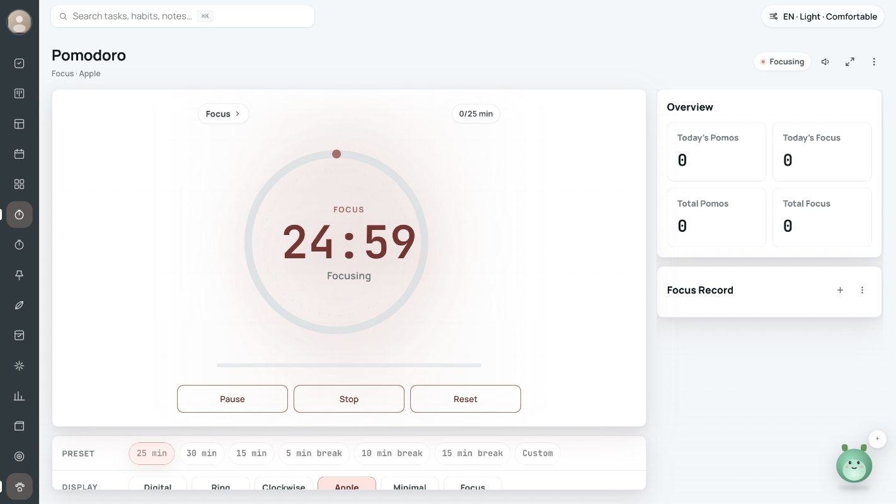
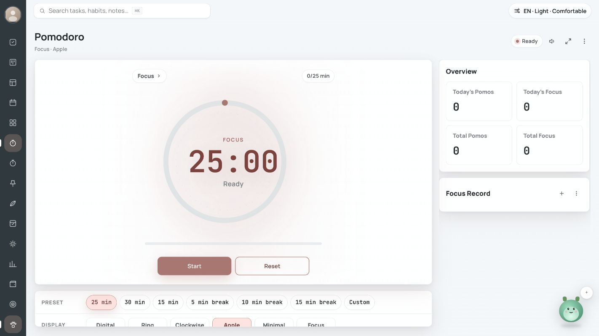
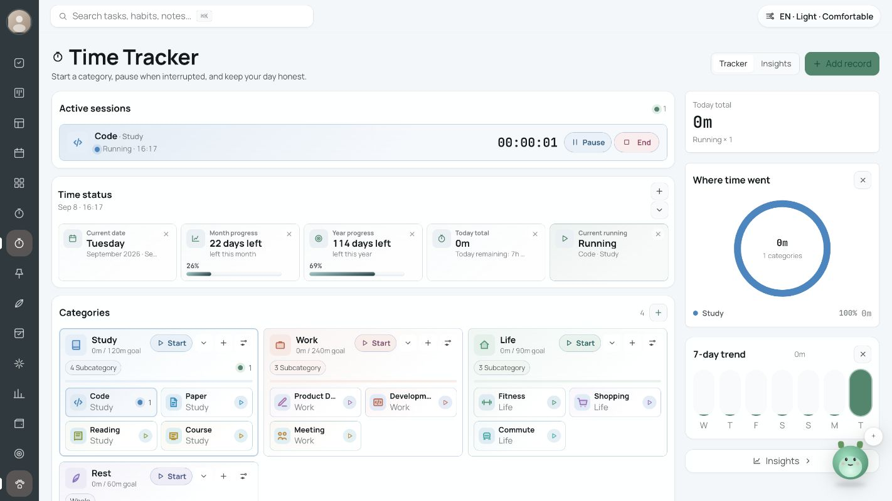
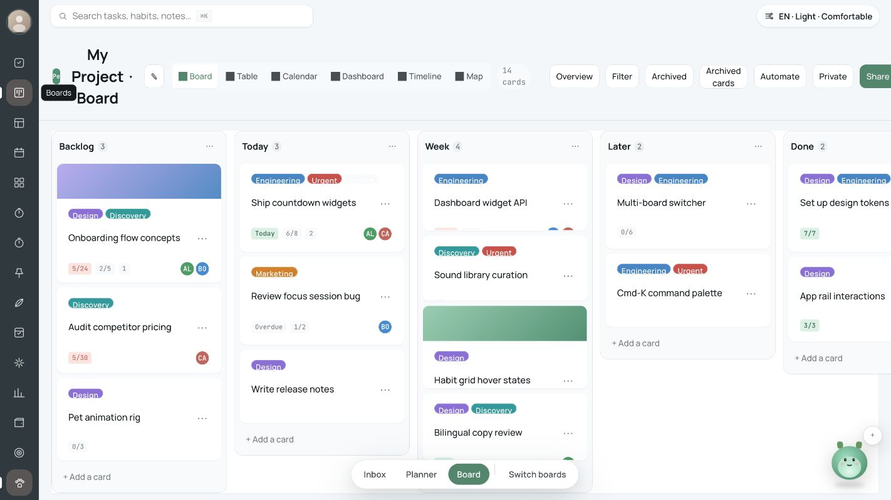
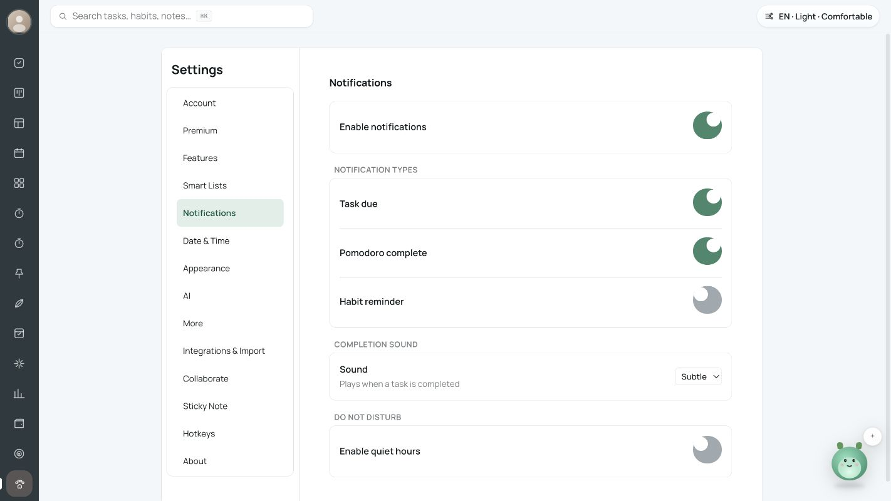
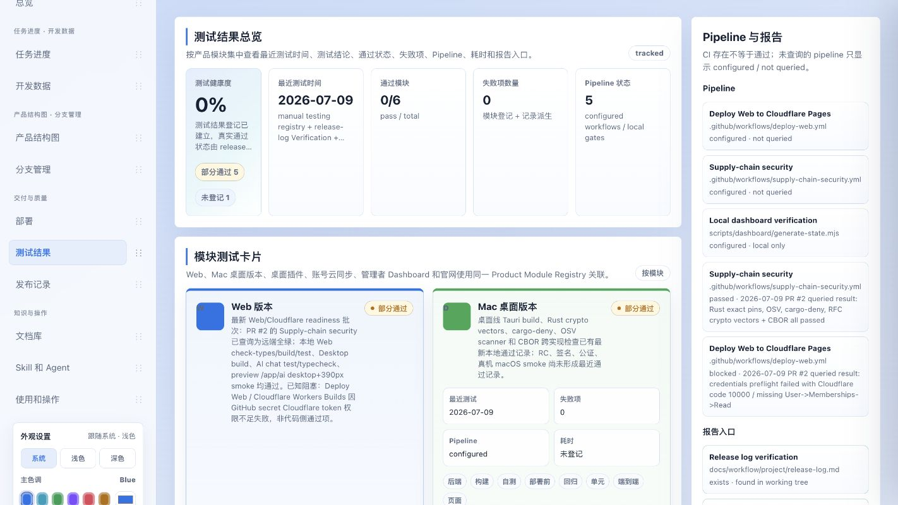

# 逐页面视觉与交互审查

审查基线：`web@9257be40c03216b1006691bfa289bd29d6dfe839`。本次通过 Codex in-app Browser 访问独立本地端口 3108（mock-authenticated、全新 origin），没有使用线上用户数据进行写入。另只读访问公开部署与 Linear 官方资料。截图是本次现场采集，非历史验收截图。

## 设计依据与取舍

已加载 high-end-visual-design、redesign-existing-projects、product-design:audit，并执行 Product Design context preflight（没有已保存的用户设计资料）。当前仓库已跟踪的 `web design/DESIGN.md`（10KB、标注 active Web console design contract）明确以 Apple Calendar、Apple Reminders、iOS Timer、Linear 为参考，目标是安静、清晰、有用的信息密度；相关 Console/Project PRD 还指向 TickTick 与 Trello。父目录同名24KB文档是历史原型，不能与当前设计合同混用；多机器文档对整个设计目录的archive-only描述应进一步细分。

通用美化 skill 中“大留白、双层嵌套卡片、持续入场动画、强制字体替换”等建议与本项目生产力工具合同有冲突，不作为整改要求。这里优先沿用现有 Manrope/Noto Sans SC 与语义 token，改善信息层级、操作可靠性、键盘能力、清晰的空态和恢复状态。`pnpm web:check-colors` 本次 PASS，但还有 808 条历史颜色字面量隔离记录；这只证明没有新增违规颜色，不能证明视觉或可访问性通过。

对比资料（2026-09-08 现查）：

- [Linear Board layout](https://linear.app/docs/board-layout)：板/列表共享大部分功能与快捷键；支持隐藏列、移动卡片快捷键与横向导航。XAI 应借鉴视图一致性和渐进显示工具，而不是只复制卡片外形。当前官方文档截图见 `33-reference-linear-board.png`，这不是对 Linear 登录后应用的全流程审查。
- [Apple Reminders Smart Lists](https://support.apple.com/en-mide/guide/iphone/iphe882772ed/ios)：Today 收集今日与逾期事项。XAI 的 Today/Tomorrow 必须有真实日期语义，不能只是旧看板列的别名。
- [Trello Automation overview](https://support.atlassian.com/trello/docs/automation-overview/)：分别区分规则、按钮、计划和到期自动化。XAI 目前应把页面触发规则的范围明确显示；要承诺关页执行，需要真实调度与执行记录。

## 采集条件与限制

桌面本地截图画布大多为 1422×800；浏览器存在 90% 缩放，因此不直接把图像像素当 CSS 像素测量。移动检查把实际 DOM `innerWidth/clientWidth` 校准为 390、`innerHeight` 为 844，Tasks/Boards 的 document scrollWidth 均为 390。截图工具在 viewport override 下出现画面缩到左上角、右侧/底部多余空白的采集问题；22–26 只作布局辅助，不能将空白判为应用缺陷，也不能用这些图片精确判断对比度/像素尺寸。检查结束已 reset viewport。27 的 Pet 按钮是开关，不是独立页面；28 才是选择器。

本轮没有执行真实 AI 付费调用、创建线上账户、更改系统通知授权、修改生产数据或实际断开整台电脑网络。暗色截图用于观感判断，未做全量 WCAG 对比度计算、屏幕阅读器或所有断点覆盖。截图文字中的示例任务/账本来自当前代码默认数据；不应据此推断真实用户记录。

## 每个可见 feature 的现状、问题、建议

| 步骤 / feature | 本次页面健康度与证据 | 存在的问题 | 对应优化建议 |
|---|---|---|---|
| 1 Shell / 主导航 | 主 rail、搜索、外观入口可用；01、02、24 | 桌面15个左右图标依赖记忆/hover；移动底部一次看不全全部入口；账户/宠物移动端隐藏 | 提供可选有文字窄侧栏、常用项与更多菜单；保留当前模块标题；移动端显式账户/设置入口；将运行计时做全局可达小条 |
| 2 AI Chat | 空态及建议问题完整；01 | 大幅模糊背景主导画面，与安静中性合同不一致；暗示附件/语音/多轮分析能力而实现未闭环；提示 Shift+Enter 但输入为单行 | 缩弱或可关闭背景；建议问题按真实可用工具生成；输入改多行；附件显示真实解析状态；流中断给“已保存到此处/重试” |
| 3 Tasks / 清单 | 02、24；桌面列与移动单列可见 | Today/Tomorrow计数是旧分桶；`inbox/book/home` 图标代码直接显示；两套筛选导航重复；桌面最右列需要横向导航却缺明确提示 | 先修真实日期和任务模型；统一筛选来源；图标映射；列表/看板切换；滚动提示与列选择；单一可识别的完成和多选控件 |
| 4 Pomodoro | 03–05；Start/Pause/Stop/Reset可见；运行后刷新归零已实测 | 六种显示、配色和预设占大量首屏；运行计时丢失；缺恢复说明；焦点记录为空没有下一步指引 | 持久化活动会话+deadline；重开呈现“继续/结束并修正”；显示样式移到折叠设置；核心区域只留模式、时间和主操作 |
| 5 Time Tracker | 06、08、26；关标签重开后继续Running | 首屏时间状态5卡占据核心操作前空间，移动端要滚动很远才能开始分类；类别名称频繁截断；16秒记录显示0m（按分钟四舍五入，不足30秒为0m）；未提示跨日记账限制 | 分类与活动会话置顶，日期/月年进度默认折叠；短时长显示秒；完整名称tooltip/自适应；恢复卡显示起始、离开时长、修正入口；每日分摊按实际时区边界 |
| 6 Calendar | 09、21、22；日/周/月/年切换入口存在 | 示例事件占满初始月历；每条Sample徽标挤掉标题；此次桌面条件下底部周行裁切，底部空白仍较大；示例下方“升级”与真实数据条件不清晰 | 默认真实空月历，示例作为明确可退出模式；示例说明集中为顶部条；月历按可用高度分配，按实际高度计算可见事件并确保现有+N可见/可打开；移动优先议程/周视图；提醒能力明确标注 |
| 7 Project Boards | 10、25；板/表/日历/统计/时间线/地图入口齐全 | 桌面标题被压成3行，单行工具过密；Archived和Archived cards相似；Overview禁用但无解释；多色标签/封面占卡片高度；底部工作区条与宠物争用空间 | 标题独立一行；主视图+过滤留前，归档/自动化/分享进“更多”；收敛标签高度；明确横向列导航；禁用操作说明原因；移动折叠底部面板条 |
| 8 Dashboard / Widgets | 11；组件可显示并提供配置入口 | 首次“Good afternoon, Hello.”不自然；时钟大而当前任务/活动计时弱；天气手动内容容易被当实时；首访Habits前后统计可变 | 默认围绕“现在做什么/当前计时/今日任务”；天气标注手动与更新时间；统一数据初始化，访问顺序不影响统计；配置操作仅编辑模式显示 |
| 9 Matrix | 12；四象限清晰 | 默认8条独立示例全落第4象限，与Tasks内容不一致；空象限占大块固定空间；用户难辨共享任务还是另一个任务库 | 若产品决定与Tasks整合则共享taskId；提供未分类收件箱；空态引导设置重要/紧急，避免自动灌示例；保留现有Cmd/Ctrl+箭头移动，增加触屏移动入口和来源链接 |
| 10 Habits | 13；列表+详情便于查看 | 周标题拥挤，打卡圆圈重叠感强；小数值/连续天数过密；7/30/100徽章和365进度占用超过当天动作；未来日期状态不清 | 44px命中区与视觉圆点分离；给今天更明确主操作；周标题对齐列；区分今日/未来/休息日；优先真实streak规则和当地日期 |
| 11 Meditation | 14；场景/时长/环境音/时钟可配 | 设置量远大于开始动作；显示时钟而非即将进行的时长；自定义HEX、12种时钟样式面向实现而非放松；后台计时和完成记录缺陷 | 默认场景+时长+开始；其余放设置抽屉；活动时突出剩余时长与静音；持久化会话、恢复elapsed、到期停音并保存完成 |
| 12 Countdown | 15；五种视图、预设明确 | New Year's Day/New year/Next year begins意图重复；开发说明table-backed进入用户文案；节日重装饰且卡片多操作嵌套 | 去重预设；描述用户事件意义；删除/隐藏/复制移菜单；时间字段显示日期+时区/重复规则；将“倒计日”和会话计时区分 |
| 13 Statistics | 16；趋势与KPI布局可读 | 新用户0数据仍出现长平线；任务数集中最后一日却无真实完成时间；页面范围与current board混合；番茄早停统计按配置时长 | 统一completedAt/elapsedMs口径；无数据呈下一步；所有KPI明确时间范围/数据源；任务与习惯与番茄的分母/粒度可解释 |
| 14 Bookkeeping | 17；账本/账户/流水/快速记账结构完整 | 默认即出现大额净资产和真实感流水，缺全局“示例”标识；英文UI混中文默认分类；多个内部滚动区；资产、预算、周期交易能力边界不清 | 首次使用选择空账本或演示；保留数据来源标识；录入动作集中；余额从流水推导或明确手动余额；导入预览、CSV往返和错误回滚优先 |
| 15 Metrics | 18；Weight之外Planned禁用较诚实 | 记录为空但默认身高178和目标70，容易被当已设置；无数据仍占据导出卡、曲线等大面积；“V1”进入产品文案 | 首次先设置个人参数和首条记录；无记录禁用或解释导出；目标明确“未设置”；用通用数值而非医学结论；单位转换不改变原始值 |
| 16 Settings / Account | 19；14个设置入口可见 | 固定mock身份；设置页Sign Out/升级/头像存在无handler入口；危险操作与基本资料并列；侧边栏很长 | 接入真实session，mock模式明确横幅；无功能入口禁用说明；账号/设备/数据管理分层；删除明确本地/云范围 |
| 17 Notifications / shared Toggle | 20；开关可辨checked但视觉异常 | 全局 `min-height:44px` 覆盖 `height:26px`，轨道变46×44、旋钮贴顶，呈月牙；提醒/DND偏好没有执行消费者 | 44px触达包装+26px可视轨道；使用统一Switch并视觉回归；展示浏览器权限与“需页面打开”条件；无后台服务前不承诺离线提醒 |
| 18 Appearance / Density / Language | 21、24；Light→Dark立即生效 | 暗色细字、边线偏弱，未量测对比度；各feature标题、按钮、卡片高度不一致；部分实现仍绕token | 建立typography/toolbar/dialog共享规范；针对实际低对比元素测量；逐包偿还808项颜色债；校验中文长文、compact和缩放，不为美化强制换字体 |
| 19 Pet | 27、28；主rail可开关，8角色选择可见 | 下右角持续覆盖记录/图表/底部操作；移动仍覆盖内容；全屏背景blur成本需关注 | 用户首次显式开启或记住选择；避让按钮/输入框、安全区；专注/录入自动收起；键盘关闭、可访问dialog语义与reduced-motion |
| 20 CmdK / Search | 29；dialog、combobox、listbox与焦点可见 | 缺结果类型/匹配字段说明；空查询只显部分模块；搜到记录后是否精确定位需逐实体验证 | 模块/任务/习惯/笔记分组；每结果显示来源和定位；键盘提示、无结果引导；所有真实rail模块统一纳入索引 |
| 21 Developer Dashboard Overview | 30；当前HEAD/dirty可追溯 | 首屏大量使用说明、技能卡，实际阻塞/线上版本在下方；百分比由人工值与异步状态混合；同步快照fresh易被理解为业务事实fresh | 首屏先线上SHA/最近失败/下一步；将使用说明折叠；每个状态附source+observedAt+ref；不用单一进度百分比表示上线成熟度 |
| 22 Developer Dashboard Testing | 31；有pipeline说明与历史日志 | 0%健康、0失败、5部分通过并存，含义不直观；同workflow重复configured与历史passed/blocked；历史检查易被误作本次 | 显示“已确认通过/失败/未知”数量；按workflow+ref去重；区别历史证据与当前HEAD；无结果用未知而不是0失败 |
| 23 Skill / Agent Dashboard | 32；66项可查，完整与自动补齐分列 | 卡片徽标和输入输出元数据过密；66/66完整但源完整度1/66，可能混淆可展示与可执行验证 | 分类表格+详情抽屉；直接显示触发/输入/下一步；“已自动推导”与“源已维护”独立；按关键工作流真实dry-run验收 |

### 代码锚点

- 全局token/字号：`packages/plugin-web-tokens/src/tokens.css:95`、`:98`。
- Switch冲突：`packages/plugin-web-settings-shell/src/styles.css:228` 与 `:235`。
- 任务图标直接输出：`packages/xai-web-tasks/src/TasksSidebar.tsx:136`；无动作状态入口见`:196`以后。
- 看板外层hidden/max-height：`packages/plugin-web-board-workspaces/src/styles.css:20`、`:40`，工具栏/标题还应连同core样式一起整改，不能仅加overflow掩盖。
- 功能错误与完整path:line清单见02、03、04分报告；视觉建议并不替代实现修复。

## 关键流程的本轮证据

1. **番茄钟：启动→刷新，失败。** `04-pomodoro-running.png` 是24:59/Focusing，`05-pomodoro-reloaded.png` 是25:00/Ready。完整前后DOM存 `pomodoro-before-after.txt`。
2. **时间追踪：Start Code→关标签→重开，运行状态恢复。** `08-time-tracker-reopened.png` 显示Running与继续累计；随后主动End形成16秒测试记录。`07`截图因点击自动滚动未展示顶部计时，不作为运行时长证据。DOM存 `time-tracker-before-after.txt`。此验证不能外推多设备、跨日精度或崩溃持久性。
3. **主题：浅色→深色，正常。** 日历09/21使用同一本地数据；不是全产品深色对比度认证。
4. **移动：Tasks/Boards重排，部分正常。** 实测390 CSS像素document无横溢，但板列仍横向、长工具栏和TimeTracker状态卡压低主操作。不能把document无横溢当全部功能可达。
5. **公开部署：`/app/ai`可直接打开，版本不同。** 34截图rail无Metrics而本地有；线上composer仍有Haiku4.5下拉。精确线上SHA仍未知，不能据截图给出提交号。

## 可直接验收的UI整改顺序

1. P1：真实日期/时间与持久化恢复；P2：数据来源与mock提示、无动作入口。可保存但不执行的提醒应明确边界；新增关页后台调度属于能力扩展，需要单独定义产品承诺。
2. P2：修共享Toggle、统一图标映射和toolbar布局；把主动作放首屏，收起次要外观设置；移动端持续计时/底部浮层避让。
3. P2：视图共享数据与键盘操作；完整空/错/加载/保存失败状态；固定含义的按钮名称和时间范围。
4. P3：逐项token债、微交互、配色和排版细节。保留轻量动效且尊重reduced-motion，不新增大面积blur或装饰性背景。

## 截图

下列是本次有效桌面证据；完整34张原始采集图在screenshots目录，部分辅助图的限制见上文。

