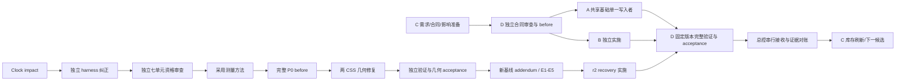

# 依赖图与锁

完整逐项节点/边在 dependencies.json（含每个未关闭项目的 prepare→review→before→implement→verify→accept→reconcile→inventory）。13个已完成项为retained terminal，不安排重跑。不同文件只是必要条件；语义读写组只是初始保守索引，具体合同必须确认消费者与影响面并增加依赖。

准备/审查的多项 read-read 可并行；源码作者与读同一可变工作树的验证者不可并行。固定 git archive 的历史读不被其他新提交改变。共用 renderer/profile/端口/设备须单一资源租约，独立路径不允许隐藏UI污染。module gate、owner decision和外部凭据条件列为external节点；blocked节点只阻塞后继。
