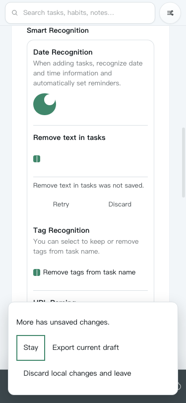
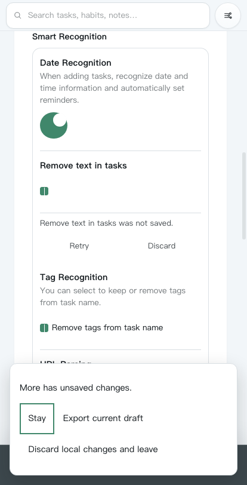
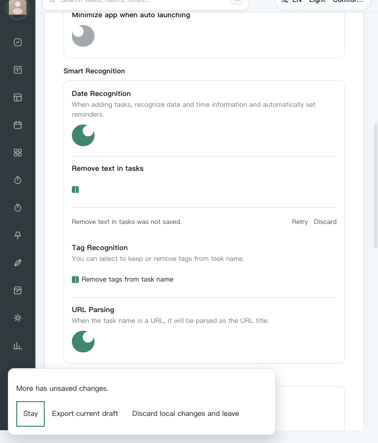
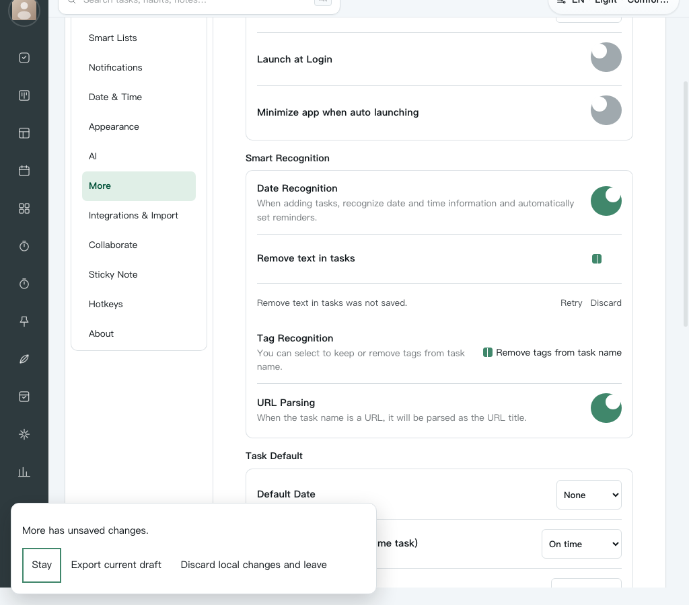
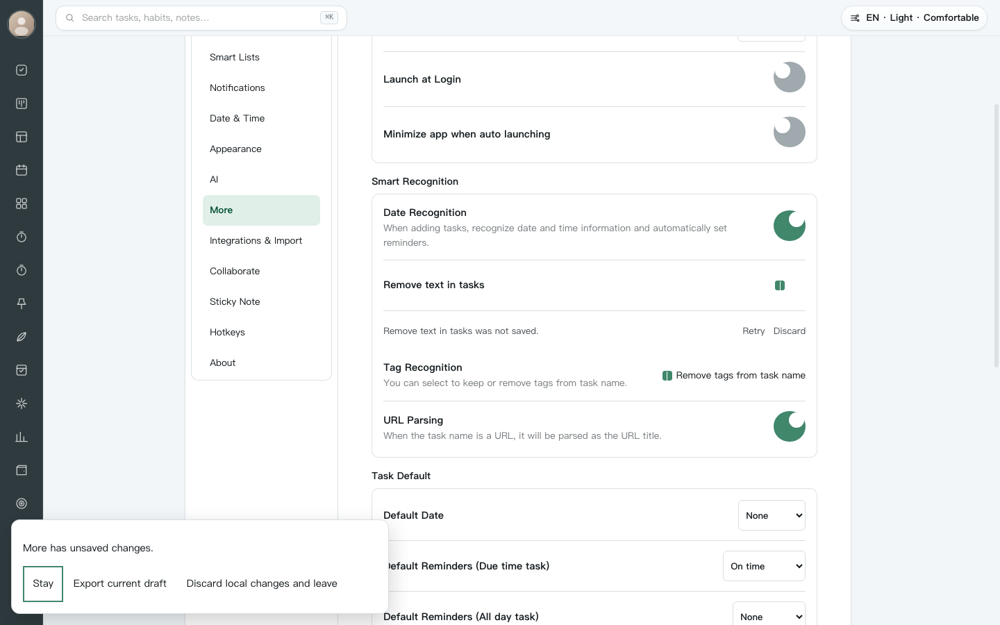
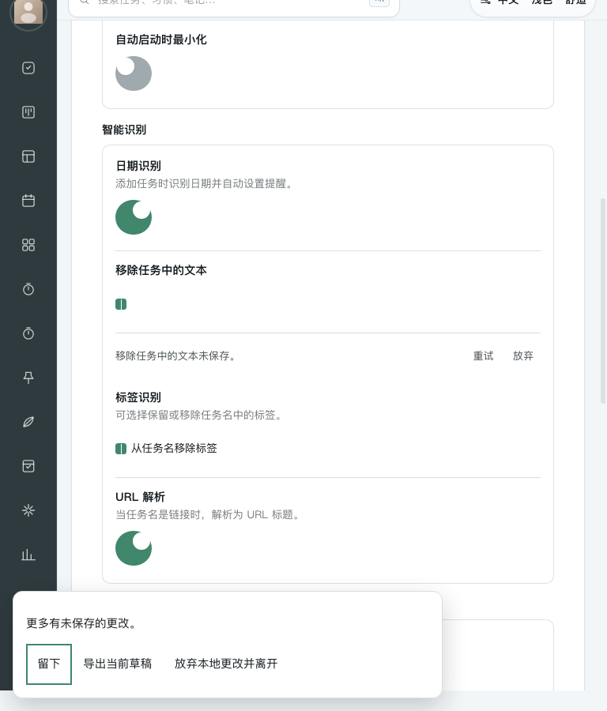

# More native N4 bilingual visual and accessibility audit

Product fixed at `7b216a3d5a4947d0f66da042fb275302737fb762`. Parent-owned real Chrome capture using the immutable archive and actual composed Settings/Shell surface.

## Verdict

**PASS for N4 `visual` and `visual-zh`.** Chrome `153.0.8010.48` reported zero runtime exceptions or console errors in both runs. All ten screenshots were opened and manually inspected after capture.

Commands:

```sh
node docs/reviews/web-more-recovery-native/verify-native.mjs 7b216a3 visual control-plane-20260917-n4-v1
node docs/reviews/web-more-recovery-native/verify-native.mjs 7b216a3 visual-zh control-plane-20260917-n4-v1
```

Authoritative logs:

- `native-7b216a3-control-plane-20260917-n4-v1-visual.log` — SHA-256 `29b22e9f736b4008bdaa9813d88f7922375e70ad870d2ce61ee4b8318631ddb3`
- `native-7b216a3-control-plane-20260917-n4-v1-visual-zh.log` — SHA-256 `25f4bcd9aea8975c77d1809fd1f7e528d4c9db66b43cb32f18f83c7b0e631125`

## Audit scope

The bounded surface is the More failed-checkbox recovery state plus the composed Settings departure dialog. The user goal is to recover or safely leave without clipped content or ambiguous keyboard focus. The accessibility target is responsive reflow, keyboard operation, visible focus, focus containment, real hit targets, and minimum 44 × 44 px actions in English and Chinese.

## Confirmed strengths

- Native Space generated a trusted checkbox click in both languages, changed the controlled draft, preserved denied physical bytes, and exposed the correct recovery state.
- The page had no horizontal document overflow at 375, 414, 768, 1024, or 1440 px. Dialog bounds and every dialog action stayed inside the viewport.
- All four More recovery actions and all three dialog actions measured at least 44 × 44 px. Recovery controls passed real center-point hit testing before the dialog opened; every dialog action passed it at all five widths.
- Native Shift+Tab and Tab wrapped from the dialog container to the last action and back to the first action. The focused first action had a visible 2 px solid outline at every width.
- Manual review found no blank state, loading capture, cropped copy, overlapped action, or wrong language. At 375 px English and Chinese actions reflowed without clipping; at 414 px Chinese actions fit on one row while English kept the longer destructive action on a second row.

## Numbered screenshot review

1. **English · 375 px — healthy.** Recovery copy wraps cleanly; all three departure actions are visible and the destructive action moves to a second row.

   

2. **English · 414 px — healthy.** The More card, recovery actions, focused Stay action, and dialog remain contained with comfortable spacing.

   

3. **English · 768 px — healthy.** Tablet reflow keeps the recovery message and actions aligned while the bottom dialog remains fully visible.

   

4. **English · 1024 px — healthy.** Sidebar, settings content, recovery state, and dialog preserve hierarchy without collision.

   

5. **English · 1440 px — healthy.** The wide layout remains bounded; the dialog does not stretch excessively and the focused action is clear.

   

6. **Chinese · 375 px — healthy.** Chinese recovery and dialog copy are complete; actions wrap without truncation or overlap.

   

7. **Chinese · 414 px — healthy.** All Chinese dialog actions fit on one row while retaining 44 px height and visible focus.

   

8. **Chinese · 768 px — healthy.** Tablet layout keeps labels, recovery actions, and dialog copy readable with no horizontal spill.

   

9. **Chinese · 1024 px — healthy.** Sidebar translations, More content, and departure actions remain visually separated and complete.

   

10. **Chinese · 1440 px — healthy.** The wide Chinese layout remains balanced and the bottom decision surface retains clear hierarchy.

    

## Non-blocking observation

The decision surface intentionally overlays the bottom of the Settings content without a visual backdrop. Its boundary, focus outline, and action hierarchy were clear in this bounded audit, but broader usability research could still compare whether background dimming improves modal separation. This is not an N4 contract failure.

## Evidence limits

Screenshots and DOM geometry do not establish complete WCAG conformance, screen-reader announcements, forced-colors behavior, browser zoom above the tested responsive widths, production authentication, or deployment behavior. Final Settings/Web/storage regressions and Astra contract reconciliation remain pending.

This result closes no 312 item, D2/REL/AI obligation, deployment gate, or release gate.
