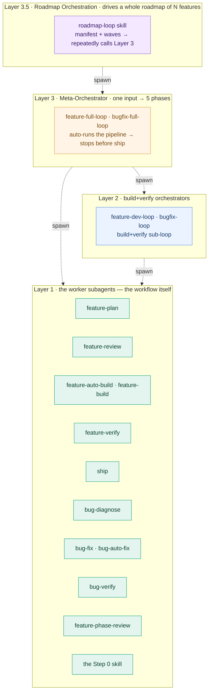
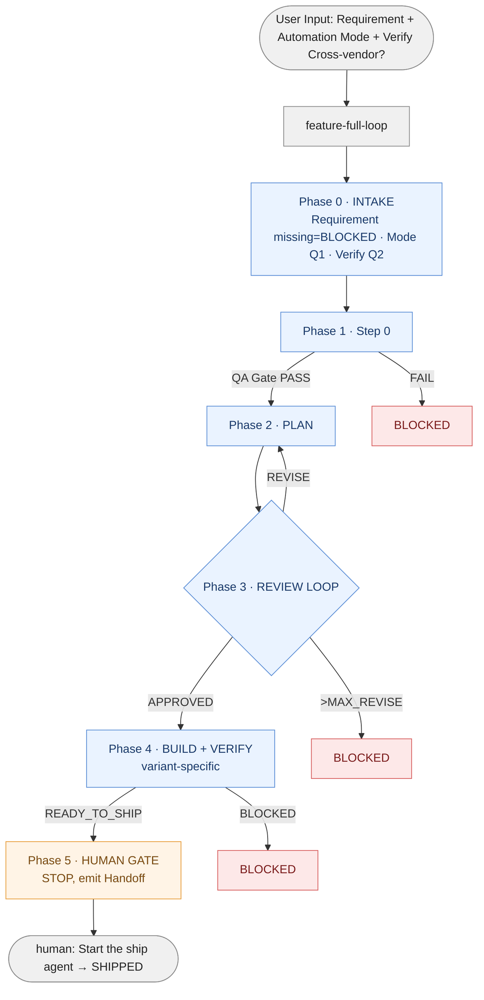

# Portable Workflow — Hands-On Usage Guide

> **Portable layer.** Project-agnostic. The cross-cutting, hands-on tutorial for the **whole**
> workflow — not just the automation loop. It ties together the manual subagent pipeline (`01` +
> `02`), the single-feature meta-orchestrator (`04`), and the roadmap orchestration skill (`06`)
> into one "how do I actually drive this" guide.
> Source: portabilized from the project's hands-on usage guide + the project's concrete V2 workflow
> doc.
> Spec details: `01-workflow-model.md` (the subagent pipelines), `02-handoff-and-state.md` (the
> handoff + state contracts), `04-automation-loop.md` (the meta-orchestrator + variants),
> `06-roadmap-orchestration.md` (the roadmap layer). Placeholders: `00-PORTABLE-MANIFEST.md`.

---

> **A note on names.** Every skill, path, agent-config dir, and variant name in this guide written
> in angle brackets (`<NAME>` form) is a placeholder — `00-PORTABLE-MANIFEST.md` §3 maps each one to
> its concrete value for a given project. `<step0-skill>` and `<skill_prefix>roadmap-loop` are **real, named
> skills** — not abstract roles — and `feature-plan` / `feature-build` / … are real, fixed agent
> names (`00` §3.5). The placeholders are only how this *portable* copy stays project-neutral. The
> project's own `usage-guide` spells the same flows out with the real skill names (and adds the
> project's full skill pipeline); this portable copy keeps placeholders so it transfers to any
> project unchanged.

---

## 0. Migrating this workflow into a new project

If you are *migrating* the portable workflow into a new project (rather than using an already-set-up project), start here. Otherwise skip to §1.

### What the migration skill does

`<skill_prefix>workflow-migrate` (defined as a draft SKILL.md in the appendix of `_portable/00-PORTABLE-MANIFEST.md`) automates §4 of `00`. It runs from the *source* project (where `_portable/` already lives) and operates on a *target* repo path. Two modes:

- **survey** — read-only. Scans the target repo, infers the §3 placeholder values, asks where ambiguous, drafts the filled placeholder table + `<project_background_file>` content + a migration plan, then STOPS for human review.
- **instantiate** — consumes a reviewed survey plan. Copies `_portable/` into the target, fills placeholders, copies and adjusts the generation script, runs it, verifies counts + lint, then STOPS and emits a project-layer checklist. Does NOT scaffold project-layer docs.

### 6-step usage flow

1. **Land the skill in your source project** (one-time). Copy the draft SKILL.md from `_portable/00-PORTABLE-MANIFEST.md` appendix into `<skill_root>/<skill_prefix>workflow-migrate/SKILL.md`, replace `<skill_prefix>`, register in your project's skill registry.
2. **Mount the target repo** in your cowork / IDE session as an additional writable folder (source project remains primary so the skill is loadable).
3. **Run survey:**
   `/<skill_prefix>workflow-migrate target: <path-to-target-repo> mode: survey`
   Skill scans target, asks where ambiguous, writes a plan file to the source project's scratch area, STOPS.
4. **Review the plan.** Edit the placeholder table if any inference looks off.
5. **Run instantiate:**
   `/<skill_prefix>workflow-migrate plan: <path-to-plan-file> mode: instantiate`
   Skill copies `_portable/`, fills placeholders, copies + adjusts the generation script, runs it, verifies, emits the project-layer checklist, STOPS.
6. **Project-layer human work.** Per the checklist: write `<project_workflow_doc>`, the SOPs, `<your_commit_convention>`; land any `<skill_prefix>`-prefixed skills; test-run on one small feature, then one bugfix.

### Common situations

- **Survey inference looks wrong** — edit the plan, re-run instantiate. Survey is read-only so this is safe.
- **You only want synchronous variants (no hook)** — skip the automation-loop reference shell-script copy step during instantiate.
- **Pre-existing `.claude/agents/` in target** — generator defaults to `.claude/agents-v2/`; pass `--replace-claude` only after test-run.

### Re-syncing an already-migrated project after an upstream update

When the source workflow gets a big update, **already-migrated projects do NOT auto-update** —
their hook layer stays frozen at migration time (B/C automation may be broken). Use the migration
skill's **`resync` mode** (`mode: resync`). It is idempotent and **non-destructive**:

- **Clean-target gate (read-only until it passes):** resync refuses to run if any path it would
  write (`_portable/` / `<cowork_scripts_dir>/` / `<templates_dir>/` / `.claude|.codex|.cursor/
  agents/` / the generator / the portable-sync lint) is git-dirty in the target — commit/stash
  first. It never clobbers uncommitted work.
- **Template conflict guard:** a hand-customized target template is never silently overwritten —
  resync lists it and STOPS for a human 3-way merge.
- It overwrites `_portable/` verbatim, re-renders the full `_portable/scripts/*` set (incl. brand
  new files) with the target's token map, re-instantiates templates + regenerates agents (minding
  the `--force` regression caveat), refreshes the portable-sync lint, and emits a **project-layer
  doc-delta checklist** the human hand-applies (it never edits the target's own workflow docs).

Full contract: `00-PORTABLE-MANIFEST.md` §4 resync mode.

### Boundary — what the skill does NOT do

- Never authors `<project_workflow_doc>` / SOPs / `<your_commit_convention>` (those need human judgment).
- Never modifies the source project's `_portable/` (only reads and copies).
- Never runs the project's actual feature pipeline.
- `resync` never writes a dirty target and never silent-overwrites a customized template.

For the runtime picker / fallback spec, see `07-automation-mode-picker.md`. For the migration skill's full contract, see `00-PORTABLE-MANIFEST.md` appendix.

---

## 1. What this guide covers — three ways to drive one workflow

There is **one** workflow paradigm — the task-typed subagent pipeline (`01`) relaying through
`dev_log.md` (`02`). What changes is **how much of it you drive by hand**. There are three levels,
and you pick per task:

| Level | You type | Who drives the pipeline | Use it when | Section |
|-------|----------|-------------------------|-------------|---------|
| **1 — Manual subagent workflow** | one command per step (or per build granularity) | you, step by step, reading `dev_log` between steps | you want full control / are learning the workflow / the meta-orchestrators are not landed yet / something went sideways and you are recovering by hand | §4 |
| **2 — Single-feature meta-orchestrator** | one command, total | `feature-full-loop` / `bugfix-full-loop` run the 5 phases, stop before `ship` | a normal feature or bugfix you want done hands-off | §5 |
| **3 — Roadmap orchestration skill** | one `init` + one `run` per wave | the `<skill_prefix>roadmap-loop` skill drives a whole roadmap of N features, wave by wave | you have a reviewed roadmap (or a PRD) of many features | §6 |

Level 2 is Level 1 with the dispatching automated. Level 3 is Level 2 called repeatedly. The **state
contracts** underneath — the `dev_log.md` Status Panel, the §2.6 write-authority matrix, the human
`ship` gate, the Universal Next Step Contract — are **identical at all three levels**. The *handoff
form* differs: Level 1 / 2 agents emit a `## Handoff` block; the Level 3 roadmap-loop skill emits a
manifest-backed wave summary instead — but it still ends with a copy-pasteable Next Step, satisfying
the same Universal Next Step Contract. Learn §4 once and §5 / §6 are mostly "who does the typing".

---

## 2. The mental model — the 3.5-layer agent architecture



**ASCII fallback:**

```text
Layer 3.5  roadmap-loop skill            drive a whole roadmap of N features      ── §6
              │ spawn (one per feature)
Layer 3    feature-full-loop /           one input → 5 phases → stop before ship  ── §5
           bugfix-full-loop
              │ spawn
Layer 2    feature-dev-loop /            build+verify sub-loop
           bugfix-loop
              │ spawn
Layer 1    12 worker subagents +         plan / review / build / verify / ship    ── §4
           feature-phase-review +        ← this IS the workflow; the layers above
           the Step 0 skill                 just automate who dispatches it
```

**Layer 1 is the workflow.** Layers 2 / 3 / 3.5 do not add new *steps* — they automate the
*dispatching* of Layer 1. When you drive at Level 1 (§4) you are dispatching Layer 1 yourself.

The 7 automation variants (`04` §3) are just **how Layer 3's Phase 4 delegates the external
executor** — they do not change Layer 1 or the phase structure.

---

## 3. Prerequisites

| Item | Needed for | Check |
|------|-----------|-------|
| the main session can spawn subagents | all levels | the spawn/Task mechanism is available |
| the 12 worker subagents are registered | all levels | `ls .claude/agents/*.md` shows the 12 (+ the `.codex/agents/` / `.cursor/agents/` configs if you run those tools) |
| the Step 0 skill is available | all levels | `ls <skill_root>/<step0-skill>/SKILL.md` |
| `feature-full-loop` + `bugfix-full-loop` are landed | Level 2, Level 3 | `ls .claude/agents/{feature-full-loop,bugfix-full-loop}.md` |
| `feature-phase-review` is landed | only the phase-granularity Level 2 variants | `ls .claude/agents/feature-phase-review.md` |
| the `<skill_prefix>roadmap-loop` skill is in place | Level 3 | `ls <skill_root>/<skill_prefix>roadmap-loop/SKILL.md` |
| the State Verification lint is wired | only when the project enforces State Verification mechanically (it is optional, project-level — `02` §4) | the project's State Verification lint script exists |
| `<project_workflow_doc>` has every role registered in its write-authority matrix | all levels | check its Status Panel write-authority matrix |

> **Level 1 works with just the 12 workers.** If the 3 meta-orchestrators are not landed yet, you
> can still run the whole workflow at Level 1 today (§4). Land the meta-orchestrators when you want
> Level 2 / Level 3.

Per-variant add-ons for Level 2 (`04` §3):

| Variant | Add-on |
|---------|--------|
| **`A-Claude`** | none |
| **`D-Codex` / `D-Cursor` / `D-Codex+Cursor`** | the `codex` and/or `cursor-agent` CLI installed and callable (on macOS also `gtimeout` / `flock` — see `04` §3.7) |
| **`B-Codex` / `B-Cursor`** | the external CLI + the dispatch script + the git post-commit hook wired (the reference scripts ship in `_portable/scripts/`) |
| **`C-Codex` / `C-Cursor`** | the `B-*` add-ons + the `feature-phase-review` subagent |

---

## 4. Level 1 — the manual subagent workflow

This is the workflow itself, driven by hand. You dispatch one subagent, read its `## Handoff` block,
and dispatch the next. The Handoff's **Next Step** line is literally the command you copy for the
next step (the Universal Next Step Contract — `02` §3.3), so "drive it manually" mostly means
"copy the Next Step line".

**When to use Level 1:** you want step-by-step control; you are learning the workflow; the
meta-orchestrators are not landed yet; or a Level 2 / Level 3 run hit a BLOCKED and you are
recovering by hand.

### 4.1 The Feature Dev pipeline

```text
Step 0 (the Step 0 skill)  →  feature-plan  →  feature-review  →  [build]  →  feature-verify  →  ship
   requirement              research +        APPROVED /         implement     independent      push gate
   normalization            phase plan        REVISE loop        the phases    verification     (human-confirmed)
```

Every arrow is a human-confirmed handoff at Level 1: you read the Handoff, then dispatch the next.

**The [build] step has three granularities** — pick one per feature:

| Granularity | Command | What it does |
|-------------|---------|--------------|
| **manual** | `feature-build` | one phase, then stops for your confirmation — dispatch it again for the next phase |
| **batch** | `feature-auto-build` | all phases continuously, stops before verify |
| **loop** | `feature-dev-loop` | all phases + verify, fully automatic, only reports |

**Standard call order (manual build granularity):**

```text
0. /<step0-skill>                              # normalize the requirement → a feature brief
1. Start the feature-plan agent.               # (reference the Step 0 brief path, or paste the brief)
2. Start the feature-review agent for <feature>.
3. (you confirm the plan)
4. Start the feature-build agent for <feature>.   # one phase
5. (you confirm the phase)
6. Start the feature-build agent for <feature>.   # next phase, repeat until all phases done
7. Start the feature-verify agent for <feature>.
8. (you confirm the verify verdict)
9. Start the ship agent for <feature>.
```

**Loop build granularity** collapses steps 4-8 into one:

```text
0. /<step0-skill>
1. Start the feature-plan agent.
2. Start the feature-review agent for <feature>.
3. (you confirm the plan)
4. Start the feature-dev-loop agent for <feature>.   # all phases + verify, automatic
5. Start the ship agent for <feature>.
```

Key constraints:

- **A new feature should run Step 0 first.** Going straight into `feature-plan` without a brief
  causes plan drift. Bugfix usually skips Step 0 — `bug-diagnose` normalizes the bug report itself.
- **`feature-review` is best given to a different executor** than `feature-plan` — same-executor
  plan + review is an echo chamber.
- `feature-verify` does not implement — it only verifies. A BLOCKED verify routes back to build.
- `ship` is never auto-triggered — it requires `READY_TO_SHIP` and a human start, at every level.

### 4.2 The Bugfix pipeline

```text
bug-diagnose  →  [fix]  →  bug-verify  →  ship
root cause +     apply      independent   push gate
fix strategy     the fix    regression    (human-confirmed)
```

The **[fix] step** has the same three granularities: `bug-fix` (one sub-fix, confirm between) /
`bug-auto-fix` (all sub-fixes, stop before verify) / `bugfix-loop` (auto-fix + verify, automatic).

**Standard call order (manual fix granularity):**

```text
1. Start the bug-diagnose agent.              # attach the bug report — diagnose normalizes it
2. (you confirm the root cause + fix strategy)
3. Start the bug-fix agent for <target>.
4. Start the bug-verify agent for <target>.
5. (you confirm the verify verdict)
6. Start the ship agent for <target>.
```

Bugfix skips Step 0 by default — `bug-diagnose` does the normalization. Only pre-run the Step 0
skill if the bug report is very vague or bundles several independent defects.

### 4.3 Reading `dev_log.md` to decide the next step

At Level 1 you do not need to remember where you are — `dev_log.md` is the source of truth. Read its
Status Panel: `Status` + `Suggested Next` tell you exactly what to dispatch. The mapping:

| `dev_log` state | manual | batch | loop |
|-----------------|--------|-------|------|
| no `dev_log`, no brief — **new feature** | `/<step0-skill>` | `/<step0-skill>` | `/<step0-skill>` |
| no `dev_log` — **new bugfix** | `bug-diagnose` | `bug-diagnose` | `bug-diagnose` |
| brief exists, no `dev_log` | `feature-plan` | `feature-plan` | `feature-plan` |
| `NEEDS_REVIEW` → `feature-review` | `feature-review` | `feature-review` | `feature-review` |
| `NEEDS_REVIEW` → `feature-plan` (REVISE) | `feature-plan` | `feature-plan` | `feature-plan` |
| `APPROVED` | `feature-build` | `feature-auto-build` | `feature-dev-loop` |
| `READY_FOR_VERIFY` | `feature-verify` | `feature-verify` | `feature-verify` |
| `BLOCKED` → `feature-build` | `feature-build` | `feature-auto-build` | `feature-dev-loop` |
| `FIX_READY` | `bug-fix` | `bug-auto-fix` | `bugfix-loop` |
| `FIX_READY_FOR_VERIFY` | `bug-verify` | `bug-verify` | `bug-verify` |
| `BLOCKED` → `bug-fix` | `bug-fix` | `bug-auto-fix` | `bugfix-loop` |
| `READY_TO_SHIP` | `ship` | `ship` | `ship` |
| `SHIPPED` + a new iteration requested | `/<step0-skill>` (increment) | same | same |

Or — simplest — just copy the **Next Step** line out of the last Handoff block. That is what it is
for.

---

## 5. Level 2 — the single-feature meta-orchestrator

At Level 2 you stop dispatching Layer 1 yourself. One command starts `feature-full-loop` /
`bugfix-full-loop`, and it runs the whole pipeline for you, stopping only before `ship`.

### 5.1 TL;DR — the one-command start

```text
Start the feature-full-loop agent.
Requirement:
  <your requirement, free text — motivation + who uses it + what problem to solve, 1-3 sentences>
Constraints:
  - <hard constraint 1>
  - <hard constraint 2>
Automation Mode: A-Claude
  # one of 8 named variants — A-Claude / B-Codex / B-Cursor / C-Codex / C-Cursor /
  #   D-Codex / D-Cursor / D-Codex+Cursor; see §5.2
```

The meta-orchestrator then runs:

```text
Step 0 (the Step 0 skill) → feature-plan → feature-review (with REVISE reflow)
   → feature-dev-loop (build + verify) → stops before ship
```

At the end you send one more line:

```text
Start the ship agent for <feature>.
```

…and confirm the push. **The whole pipeline has just 2 user interactions** (start + ship
confirmation). If you find yourself hand-typing `feature-plan` / `feature-review` in the middle,
you have dropped to Level 1 — go back to the one command above.

### 5.2 The `Automation Mode` options — and which to pick

`Automation Mode` is **one mandatory line** in the start command, and its value is one of **8 named
variants**. The paradigm has three tools: **Claude Code** is the lead; **Codex** and **Cursor** are
the two external executors. The variants are `1 single-IDE + 3 cross-tool families × 2 external
executors = 7`, plus `D-Codex+Cursor` as D's quota-resilient combo (`04` §3):

| `Automation Mode:` value | Family | What it is |
|--------------------------|--------|------------|
| **`A-Claude`** | single-IDE | the whole pipeline runs in Claude Code; native Task-spawn, no external executor |
| **`B-Codex`** | hook-relay | lead runs plan/review; a hook dispatches headless `codex exec` for build (see `04` §3.4 — the desktop-app path is a degraded manual fallback, not the automated one) |
| **`B-Cursor`** | hook-relay | same, but the build runs headless via `cursor-agent` |
| **`C-Codex`** | phase-granularity | per phase: one Codex build + one lead `feature-phase-review` |
| **`C-Cursor`** | phase-granularity | per phase: one Cursor build + one lead `feature-phase-review` |
| **`D-Codex`** | lead-and-delegate | the `feature-auto-build` worker delegates a phase to `codex exec`; falls back to self |
| **`D-Cursor`** | lead-and-delegate | the worker delegates a phase to `cursor-agent`; falls back to self |
| **`D-Codex+Cursor`** | lead-and-delegate | the 3-layer fallback chain Codex → Cursor → self — the most quota-resilient variant |

Phases 0/1/2/3/5 are identical across all 8 — **only Phase 4 (build+verify) differs** (`04` §7).
These names are **portable canonical** — Codex and Cursor are the paradigm's two external
executors, not project-specific placeholders (`04` §3, §10).

> **How Phase 0 INTAKE resolves its 3 fields at runtime:** (1) **Requirement/Bug** missing on a
> fresh start → hard STOP `BLOCKED` (free-text is not pickable; never a question) — `07` §1A;
> (2) **Automation Mode** missing → AskUserQuestion Q1, 4 options (`A-Claude` / `D-Codex+Cursor` /
> `D-Codex` / `D-Cursor`; B/C reachable only by explicit invocation); (3) **Verify Cross-vendor**
> missing → AskUserQuestion Q2 *in the same call* (`07` §2.6; safe default `yes` if the host
> can't ask). See `_portable/07-automation-mode-picker.md` for the full picker spec (preview
> content, trigger conditions, write-authority) and how roadmap-loop asks per-feature at init with
> a smart inheritance shortcut.

**Which to pick the first time:**

```text
Do you have a usable external coding CLI / subscription?
├── no  → A-Claude (default, most stable — everything in one IDE)
├── yes →
│   want the absolute simplest? → A-Claude
│   want to feel the worker delegate to an external CLI? → D-Codex or D-Cursor
│   want the strongest quota resilience? → D-Codex+Cursor (Codex → Cursor → self)
High-risk change (touches core / a config manifest / cross-module)?
├── yes + hook/dispatch infra landed → C-Codex or C-Cursor (per-phase dual-executor cross-check)
└── yes + infra not landed yet       → run it on D-Codex+Cursor first, upgrade later
```

**Three-step recommendation for a new team:** first feature → `A-Claude` (watch the whole flow);
second → `D-Codex` or `D-Cursor` (feel the worker delegate); third → `D-Codex+Cursor` (quota
resilience). The `B-*` (hook-relay) and `C-*` (phase-granularity) variants are experimental — defer
them until the hook/dispatch infrastructure is landed and the team is comfortable (`04` §3.2).

### 5.3 What the orchestrator does for you — the 5 phases

Per the 5-phase state machine in `04` §7. You type nothing here.



- **Phase 0 — INTAKE.** Parse your Requirement; derive the candidate feature name (ambiguous →
  stops and asks); parse the Automation Mode (missing → stops and asks). Read-only on `dev_log`.
- **Phase 1 — Step 0.** Brief exists → skip. Else → spawn the Step 0 skill, confirm the QA Gate
  passed; if not → STOP.
- **Phase 2 — Planning.** Spawn `feature-plan`; Read `dev_log` to confirm `NEEDS_REVIEW`.
- **Phase 3 — Review Loop.** `feature-review` → APPROVED breaks out; REVISE reflows to
  `feature-plan` (capped at MAX_REVISE, default 3); BLOCKED → STOP.
- **Phase 4 — Build + Verify.** The only variant-specific phase. Synchronous families run in one
  session; event-driven families dispatch, write a marker, exit, and a hook notifies you to resume
  (`04` §7.2). Ends with `READY_TO_SHIP`.
- **Phase 5 — Human Gate.** Stops and emits a Handoff. Does not spawn `ship`.

### 5.4 Worked examples

**Example A — `A-Claude`, a small settings increment:**

```text
Start the feature-full-loop agent.
Requirement:
  Add an "auto-renewal reminder" toggle to the settings page. Default on.
  When off, the renewal-failure email still sends, but no in-app notification.
Constraints:
  - reuse the existing user-settings module
  - no new database table
Automation Mode: A-Claude
```

Runs Step 0 → `feature-plan` → `feature-review` → APPROVED → `feature-dev-loop` → `READY_TO_SHIP`.
You then type `Start the ship agent for <feature>.`

**Example B — `D-Codex+Cursor` (fallback chain), a cross-layer feature:**

```text
Start the feature-full-loop agent.
Requirement:
  Give paid-tier users a "export history as CSV" capability: async job, email when done.
Constraints:
  - reuse the email preference in the user-settings module
  - queue cap of 3 jobs per user
Automation Mode: D-Codex+Cursor
```

After the first 3 phases, Phase 4 spawns `feature-dev-loop`; the worker reads the `Automation Mode`
from `dev_log` and decides per phase whether to delegate to an external CLI, falling through the
fallback chain on a quota cap.

**Example C — a fully automatic bugfix:**

```text
Start the bugfix-full-loop agent.
Bug:
  After login, users intermittently land on a 404 page (~5% repro rate).
  Console shows "auth/me returns 200 but user.role is null".
Automation Mode: D-Codex
```

Runs `bug-diagnose` → `bug-fix` (possibly delegated) → `bug-verify` → stops before ship. (Bugfix has
no phase-granularity variant — use `A-Claude` / `B-Codex` / `B-Cursor` / `D-Codex` / `D-Cursor` /
`D-Codex+Cursor`; see `04` §3.)

---

## 6. Level 3 — the roadmap orchestration skill

When you have **many** features — a reviewed roadmap, or a raw PRD / multi-subsystem plan — do not
hand-dispatch `feature-full-loop` N times. Use the `<skill_prefix>roadmap-loop` skill: one
`SKILL.md`, two modes.

### 6.1 The shape

- **`init`** — feed it the source doc. If it is a **pre-decomposed roadmap doc**, `init` parses it
  into a manifest. If it is a **raw PRD**, `init` *decomposes* it: reads your project structure,
  carves the work into independent features, analyses how they relate, infers the dependency graph,
  writes a seed brief per feature, and — when a boundary or dependency is genuinely ambiguous —
  **asks you a focused multiple-choice question** rather than guessing. Either way it produces a
  manifest file and **stops for your review**.
- **`run`** — per dependency wave: type it once and walk away. The skill drives a `feature-full-loop`
  for every feature whose dependencies are satisfied, each in its own context, then stops with a
  `READY_TO_SHIP` queue. You batch-`ship` that queue, then `run` again for the next wave.

### 6.2 The three actions

```text
# Action 1 — init (once per roadmap)
/<skill_prefix>roadmap-loop
mode: init
source: <roadmap_source_doc>          # a pre-decomposed roadmap doc OR a raw PRD

# (review the generated manifest — on the decompose path, review it substantively:
#  the feature boundaries, the dependency graph, the Decomposition Rationale)

# Action 2 — run (once per dependency wave — type it and walk away)
/<skill_prefix>roadmap-loop
manifest: <roadmap_manifest_dir>/<roadmap_name>.md

# Action 3 — batch ship (once at the end of each wave)
Start the ship agent for <slug>.       # for each slug in the READY_TO_SHIP queue
```

Loop: `init → (run → batch ship) × W → wrap-up`.

### 6.3 Full detail

The manifest schema, the skill logic, the failure model, a worked example, and the troubleshooting
table are all in **`06-roadmap-orchestration.md`** — Part A is the spec, Part B is the hands-on
tutorial, the appendix is the `SKILL.md` draft. Level 3 changes nothing about Levels 1-2: each
feature still runs the exact same 5-phase pipeline inside its spawned `feature-full-loop`.

---

## 7. When it stops — Handoff types & what to do

Levels 1 and 2 relay through the `## Handoff` block; the Level 3 roadmap-loop skill relays through
a manifest-backed wave summary instead (its stop conditions are different — see §6 and `06` §A7.4).
At **Level 2** the meta-orchestrator exits with one of 2 Handoff types.

### 7.1 `Status: READY_TO_SHIP` (success)

Follow the Next Step — type `ship`.

### 7.2 `Status: BLOCKED` (stuck on some phase)

Read the Handoff's **Phase Stopped** + **Blockers** fields, then:

| Phase Stopped | Common Blocker | What to do |
|---------------|----------------|------------|
| Phase 1 (Step 0) | brief QA Gate failed | revise the requirement text, re-run the orchestrator |
| Phase 2 (Plan) | name ambiguity / plan agent self-BLOCKED | follow the Blocker hint; **drop to Level 1**, run `feature-plan` by hand to resolve, then resume |
| Phase 3 (Review Loop) | plan/review did not converge in MAX_REVISE rounds | almost always an ambiguous requirement; go back to Step 0 and rewrite the brief |
| Phase 4 (Build) | the build loop BLOCKED N times | read `dev_log` Blockers; usually needs human intervention at Level 1 |
| Phase 4 (no hook notification for a long time) | the external executor is unresponsive | check whether the external process is alive; quota cap hit? dispatch-script log? `awaiting_*` marker still in `<orchestrator_marker_dir>`? |
| Phase 4 (Verify) | verify BLOCKED | read verify's Failing Scenarios; trigger the bugfix pipeline |

**Resume mode** — after fixing, type:

```text
Start the feature-full-loop agent for <feature>.
```

The orchestrator reads the current `dev_log` Status and jumps to the correct phase; it does not redo
finished phases. (Resume priority: marker file → marker-typed branch → plain Status branch — `04`
§7.3.)

**Dropping to Level 1 to recover** is the normal escape hatch — a BLOCKED orchestrator hands you a
`dev_log` in a known state, and §4.3's table tells you exactly which subagent to dispatch by hand.

### 7.3 Three things to never do (every level)

1. **Do not manually spawn a child agent while an orchestrator is running** — it contends for
   resources and causes write conflicts. (Dropping to Level 1 is only for *after* it has stopped.)
2. **Do not hand-edit the `dev_log` Status Panel** — only the agents in the `02` §2.6
   write-authority matrix may. The trailer lint will reject the commit otherwise.
3. **Do not let any orchestrator auto-run `ship`** — `ship` must be human; this is a hard constraint.

---

## 8. Which `dev_log` lines to watch

While anything is running, watch progress in another window with
`tail -f <feature_root>/<feature>/docs/dev_log.md`. The key block is the **Status Panel**:

```markdown
## Current Status
- Workflow: FEATURE_DEV
- Target: <feature>
- Status: APPROVED                         ← current stage
- Suggested Next: feature-auto-build       ← what runs next
- Executor: feature-review (...)           ← who wrote the last update
- Updated: <YYYY-MM-DD HH:MM>
- Automation Mode: <variant identifier>    ← what Layer 2 routes on
```

Every Status flip is checked for a commit trailer (`Co-authored-by: <status_writer>
<workflow-v2@local>`), so `git log` is also a good window onto workflow health:

```bash
git log --format="%h %s%n%b" -10 | grep -E "^(commit|Co-authored-by)"
```

---

## 9. Quick reference

### 9.1 All the commands, by level

```text
# ── Level 1 — manual subagent workflow ──
/<step0-skill>                                   # Step 0 — normalize a requirement
Start the feature-plan agent.                    # entry agent — attach the brief / requirement
Start the feature-review agent for <feature>.
Start the feature-build agent for <feature>.     # one phase (manual granularity)
Start the feature-auto-build agent for <feature>.# all phases, stop before verify (batch)
Start the feature-dev-loop agent for <feature>.  # all phases + verify (loop)
Start the feature-verify agent for <feature>.
Start the bug-diagnose agent.                    # entry agent — attach the bug report
Start the bug-fix agent for <target>.            # / bug-auto-fix / bugfix-loop
Start the bug-verify agent for <target>.
Start the feature-phase-review agent for <feature>.   # phase-granularity variants only
  Phase: <N>
  Commits: <first_hash>..<last_hash>

# ── Level 2 — single-feature meta-orchestrator ──
# Automation Mode: one of 8 named variants (see §5.2) —
#   A-Claude / B-Codex / B-Cursor / C-Codex / C-Cursor / D-Codex / D-Cursor / D-Codex+Cursor
Start the feature-full-loop agent.
Requirement: <your requirement, free text>
Constraints: <optional hard constraints>
Automation Mode: A-Claude

Start the bugfix-full-loop agent.
Bug: <symptom + repro>
Automation Mode: D-Codex

Start the feature-full-loop agent for <feature>.      # resume after a BLOCKED

# ── Level 3 — roadmap orchestration skill ──
/<skill_prefix>roadmap-loop
mode: init
source: <roadmap_source_doc>

/<skill_prefix>roadmap-loop
manifest: <roadmap_manifest_dir>/<roadmap_name>.md

# ── the human ship gate (every level, always manual) ──
Start the ship agent for <feature>.
```

### 9.2 Status flip rhythm

```text
intake / Step 0      → (no Status)
feature-plan         → NEEDS_REVIEW
feature-review       → APPROVED  or  NEEDS_REVIEW(REVISE) → back to feature-plan
feature-(auto-)build → READY_FOR_VERIFY  or  BLOCKED
                       (phase-granularity variants: the last phase does not flip
                        READY_FOR_VERIFY; verify decides for itself)
feature-phase-review → only writes Phase N Verdict: PASS/BLOCKED (never the Status Panel)
feature-verify       → READY_TO_SHIP  or  BLOCKED
bug-diagnose         → FIX_READY
bug-(auto-)fix       → FIX_READY_FOR_VERIFY  or  BLOCKED
bug-verify           → READY_TO_SHIP  or  BLOCKED
ship (human)         → SHIPPED
```

### 9.3 When an orchestrator stops (Level 2 / 3)

1. ✅ Phase 5 natural end → `Status: READY_TO_SHIP`, waiting for you to ship
2. ❌ Step 0 QA Gate failed → BLOCKED
3. ❌ Plan/Review did not converge in MAX_REVISE rounds → BLOCKED
4. ❌ Build BLOCKED N times → BLOCKED
5. ❌ event-driven family: no hook notification for a long time → diagnose the dispatch script /
   external executor state manually

In every case the escape hatch is the same: read `dev_log`, drop to Level 1 (§4.3), recover by hand.

### 9.4 Trailer enforcement (commit lint)

```text
feature-plan         commit: Co-authored-by: feature-plan <workflow-v2@local>
feature-review       commit: Co-authored-by: feature-review <workflow-v2@local>
feature-build        commit: Co-authored-by: feature-build <workflow-v2@local>
feature-auto-build   commit: Co-authored-by: feature-auto-build <workflow-v2@local>
feature-verify       commit: Co-authored-by: feature-verify <workflow-v2@local>
bug-diagnose         commit: Co-authored-by: bug-diagnose <workflow-v2@local>
bug-fix              commit: Co-authored-by: bug-fix <workflow-v2@local>
bug-auto-fix         commit: Co-authored-by: bug-auto-fix <workflow-v2@local>
bug-verify           commit: Co-authored-by: bug-verify <workflow-v2@local>
ship                 commit: Co-authored-by: ship <workflow-v2@local>

(The trailer role name must be the exact literal agent name — the lint rejects any
abbreviation or grouping.)
```

The orchestration roles:

- `feature-full-loop` / `bugfix-full-loop` (meta-orchestrators) — **no trailer needed**: they only
  append Work Log entries, never flip the Status Panel.
- `feature-phase-review` (phase-granularity variants) — **recommended but not enforced**: it only
  writes the Phase Verdict, not the Status Panel.
- the `<skill_prefix>roadmap-loop` skill — **never writes a `dev_log` Status Panel at all** (it only
  writes its own manifest file), so no trailer applies.
