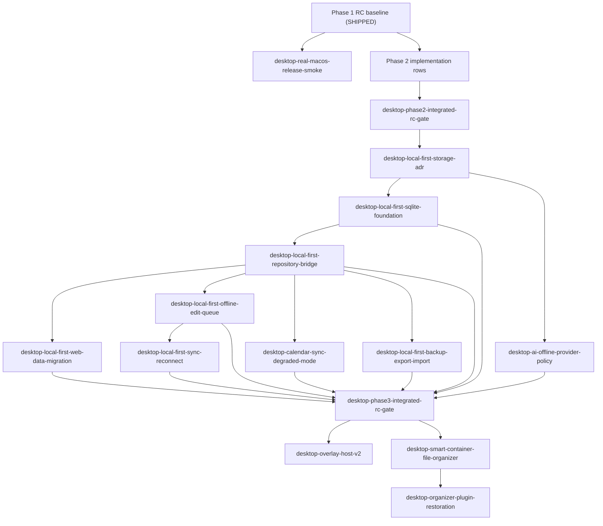

# Roadmap Manifest — xai-desktop-remaining-p2-p3-future

- Roadmap Source: inline PRD from 2026-05-28 `/xai-roadmap-loop mode: init` request
- Source Context: `CLAUDE.md`, `AGENTS.md`, `docs/workflow/project/usage-guide.md`, `docs/PLUGIN_MAP.md`, `docs/SYSTEM_ARCHITECTURE.md`, `docs/adr/0011-p1-react-tauri-local-first-hybrid.md`, `docs/audit/2026-05-26-web-completeness-and-p1-redefinition.md`, `docs/audit/2026-05-26-patch-roadmap-source.md`, `packages/desktop-phase1-rc-release-gate/docs/dev_log.md`
- Requested ADR Path Note: `docs/adr/0011-p1-desktop-redefinition.md` was not present; `docs/adr/0011-p1-react-tauri-local-first-hybrid.md` is the accepted ADR-0011 file used for this init.
- Init Path: decompose
- Generated: 2026-05-28
- Default Automation Mode: B-Codex
- Default Dependency Semantics: shipped
- Default Verify Cross-vendor: yes
- Wave Concurrency Cap: 3
- BG Direct Verified: unknown
- Manifest Review: REQUIRED
- Branch Scope: `dev` only for this desktop/Tauri roadmap. Do not create new branch names from this manifest.
- Ship Gate: human-triggered only. Roadmap-loop must never run `ship`.
- Phase 1 Baseline: `desktop-tauri-web-dist-normal-window`, `desktop-web-auth-offline-mode`, `desktop-phase1-build-packaging-pipeline`, `web-external-runtime-offline-gates`, `desktop-basic-macos-menu-config-store`, and `desktop-phase1-rc-release-gate` are already SHIPPED and are treated as external preconditions, not rows to reopen.
- Overlay Boundary: quarantined transparent overlay/control/grid assets are preserved for P3+ reuse; they must not be moved back into P1 Phase 2.

## Features

| # | Slug | Source | Depends On | Dep Semantics | Status | Automation Mode | Verify Cross-vendor | Last Run | Note |
|---|------|--------|------------|---------------|--------|-----------------|---------------------|----------|------|
| 1 | desktop-real-macos-release-smoke | docs/reviews/desktop-real-macos-release-smoke/20260528-roadmap-seed.md | — | — | BLOCKED | (default) | (default) | 2026-05-28 01:08 PDT | Environment-only manual real-macOS GUI blockers: offline bundled launch, Finder drag-install launch, native menu clicks, and monitor-topology relaunch were not directly observable in this non-interactive run. |
| 2 | desktop-native-notifications-reminders | docs/reviews/desktop-native-notifications-reminders/20260528-roadmap-seed.md | — | — | SHIPPED | (default) | (default) | 2026-05-28 21:15 PDT | Shipped on `dev`; automated gates passed. Residual external-release risk remains real interactive macOS notification UX/manual Notification Center behavior on hardware. |
| 3 | desktop-statusbar-quick-actions | docs/reviews/desktop-statusbar-quick-actions/20260528-roadmap-seed.md | — | — | SHIPPED | (default) | (default) | 2026-05-28 21:19 PDT | Shipped on `dev`; automated gates passed. Residual release risk remains real macOS tray click/focus behavior on physical hardware. |
| 4 | desktop-global-hotkey-quick-open | docs/reviews/desktop-global-hotkey-quick-open/20260528-roadmap-seed.md | — | — | SHIPPED | (default) | (default) | 2026-05-28 21:24 PDT | Shipped on `dev`; automated gates passed after phase-bounded history repair. Residual external-release risk remains real macOS shortcut conflict/focus/persistence manual smoke on hardware. |
| 5 | desktop-full-macos-menu-polish | docs/reviews/desktop-full-macos-menu-polish/20260528-roadmap-seed.md | — | — | SHIPPED | (default) | (default) | 2026-05-28 21:26 PDT | Shipped on `dev`; automated gates passed. Residual external-release risk remains real macOS native menu interaction ergonomics/support-placement checks on hardware. |
| 6 | desktop-auto-update-release-channel | docs/reviews/desktop-auto-update-release-channel/20260528-roadmap-seed.md | — | — | READY_TO_SHIP | (default) | (default) | 2026-05-28 06:07 PDT | Awaiting human ship; automated check/status-only updater gates passed, with real internal endpoint/key/signing smoke and Apple signing/notarization retained as downstream/manual gates. |
| 7 | desktop-last-data-cache-polish | docs/reviews/desktop-last-data-cache-polish/20260528-roadmap-seed.md | — | — | READY_TO_SHIP | (default) | (default) | 2026-05-28 06:52 PDT | Awaiting human ship; automated cache/display gates passed, with real macOS offline relaunch checks for readable/absent/malformed cache retained as ship-time manual checks. |
| 8 | desktop-phase2-integrated-rc-gate | docs/reviews/desktop-phase2-integrated-rc-gate/20260528-roadmap-seed.md | desktop-native-notifications-reminders, desktop-statusbar-quick-actions, desktop-global-hotkey-quick-open, desktop-full-macos-menu-polish, desktop-auto-update-release-channel, desktop-last-data-cache-polish | ready_to_ship | READY_TO_SHIP | (default) | (default) | 2026-05-28 07:16 PDT | Awaiting human ship; repo-side integrated Phase 2 RC gates passed, with real-macOS interactive checks for all six slices and row #1 release smoke retained as external-release prerequisites. |
| 9 | desktop-local-first-storage-adr | docs/reviews/desktop-local-first-storage-adr/20260528-roadmap-seed.md | desktop-phase2-integrated-rc-gate | shipped | PENDING | (default) | (default) | — | P1-Phase3 architecture gate; must ship before any Phase 3 storage implementation starts unless a human edits this manifest to allow parallel planning. |
| 10 | desktop-local-first-sqlite-foundation | docs/reviews/desktop-local-first-sqlite-foundation/20260528-roadmap-seed.md | desktop-local-first-storage-adr | shipped | PENDING | (default) | (default) | — | P1-Phase3 foundation; selected storage implementation starts only after the ADR is accepted and shipped. |
| 11 | desktop-local-first-repository-bridge | docs/reviews/desktop-local-first-repository-bridge/20260528-roadmap-seed.md | desktop-local-first-sqlite-foundation | shipped | PENDING | (default) | (default) | — | P1-Phase3 bridge across tasks, board, habits, pomodoro, notes, pet basic state, and local settings. |
| 12 | desktop-local-first-web-data-migration | docs/reviews/desktop-local-first-web-data-migration/20260528-roadmap-seed.md | desktop-local-first-repository-bridge | shipped | PENDING | (default) | (default) | — | P1-Phase3 migration/import from Web localStorage/IndexedDB without corrupting browser Web behavior. |
| 13 | desktop-local-first-offline-edit-queue | docs/reviews/desktop-local-first-offline-edit-queue/20260528-roadmap-seed.md | desktop-local-first-repository-bridge | shipped | PENDING | (default) | (default) | — | P1-Phase3 offline edit queue and sync-log staging; conflict and rollback semantics required. |
| 14 | desktop-local-first-sync-reconnect | docs/reviews/desktop-local-first-sync-reconnect/20260528-roadmap-seed.md | desktop-local-first-offline-edit-queue | shipped | PENDING | (default) | (default) | — | P1-Phase3 reconnect sync; account/cloud collaboration remains explicitly network-required. |
| 15 | desktop-ai-offline-provider-policy | docs/reviews/desktop-ai-offline-provider-policy/20260528-roadmap-seed.md | desktop-local-first-storage-adr | shipped | PENDING | (default) | (default) | — | P1-Phase3 AI offline policy; default is "available when online"; local LLM only if ADR or feature plan approves. |
| 16 | desktop-calendar-sync-degraded-mode | docs/reviews/desktop-calendar-sync-degraded-mode/20260528-roadmap-seed.md | desktop-local-first-repository-bridge | shipped | PENDING | (default) | (default) | — | P1-Phase3 third-party calendar sync remains online-only but must degrade and reconcile cleanly. |
| 17 | desktop-local-first-backup-export-import | docs/reviews/desktop-local-first-backup-export-import/20260528-roadmap-seed.md | desktop-local-first-repository-bridge | shipped | PENDING | (default) | (default) | — | P1-Phase3 backup/export/import tooling with restore verification and clear failure semantics. |
| 18 | desktop-phase3-integrated-rc-gate | docs/reviews/desktop-phase3-integrated-rc-gate/20260528-roadmap-seed.md | desktop-local-first-sqlite-foundation, desktop-local-first-repository-bridge, desktop-local-first-web-data-migration, desktop-local-first-offline-edit-queue, desktop-local-first-sync-reconnect, desktop-ai-offline-provider-policy, desktop-calendar-sync-degraded-mode, desktop-local-first-backup-export-import | ready_to_ship | PENDING | (default) | (default) | — | P1-Phase3 integrated RC across offline edit/relaunch, reconnect sync, backup/restore, AI/calendar degradation. |
| 19 | desktop-overlay-host-v2 | docs/reviews/desktop-overlay-host-v2/20260528-roadmap-seed.md | desktop-phase3-integrated-rc-gate | shipped | PENDING | (default) | (default) | — | P3+ Future; optional overlay mode only, using quarantined legacy assets where useful; must not replace normal app host. |
| 20 | desktop-smart-container-file-organizer | docs/reviews/desktop-smart-container-file-organizer/20260528-roadmap-seed.md | desktop-phase3-integrated-rc-gate | shipped | PENDING | (default) | (default) | — | P3+ Future; Smart Container/file organization re-evaluation after local-first fundamentals are stable; overlay host is optional. |
| 21 | desktop-organizer-plugin-restoration | docs/reviews/desktop-organizer-plugin-restoration/20260528-roadmap-seed.md | desktop-smart-container-file-organizer | shipped | PENDING | (default) | (default) | — | P3+ Future; restore, merge, or retire legacy desktop organizer plugins based on post-Phase3 architecture. |

## Dependency Graph



## Wave Plan

Computed from `Depends On`, `Dep Semantics`, and current `PENDING` statuses. Already SHIPPED Phase 1 rows are treated as external preconditions, not manifest rows.

| Wave | Eligible rows after review | Notes |
|---|---|---|
| W0 | `desktop-real-macos-release-smoke`; `desktop-native-notifications-reminders`; `desktop-statusbar-quick-actions`; `desktop-global-hotkey-quick-open`; `desktop-full-macos-menu-polish`; `desktop-auto-update-release-channel`; `desktop-last-data-cache-polish` | Phase 1 residual hardware smoke can run in parallel with Phase 2 implementation. Use concurrency cap 3 if dispatching via bg; use emit by default for portability. |
| W1 | `desktop-phase2-integrated-rc-gate` | Unlocks once Phase 2 implementation rows reach READY_TO_SHIP or SHIPPED. Human must ensure `desktop-real-macos-release-smoke` is SHIPPED before external release. |
| W2 | `desktop-local-first-storage-adr` | ADR-first gate for Phase 3. Do not start Phase 3 implementation before this row ships unless a human explicitly edits the manifest. |
| W3 | `desktop-local-first-sqlite-foundation`; `desktop-ai-offline-provider-policy` | Storage implementation and AI offline policy can proceed after ADR acceptance. |
| W4 | `desktop-local-first-repository-bridge` | Bridges the selected storage foundation into local-first entity repositories. |
| W5 | `desktop-local-first-web-data-migration`; `desktop-local-first-offline-edit-queue`; `desktop-calendar-sync-degraded-mode`; `desktop-local-first-backup-export-import` | Parallel Phase 3 data/user-safety work after the repository boundary ships. |
| W6 | `desktop-local-first-sync-reconnect` | Requires offline edit queue semantics first. |
| W7 | `desktop-phase3-integrated-rc-gate` | Unlocks once all Phase 3 implementation rows reach READY_TO_SHIP or SHIPPED. |
| W8 | `desktop-overlay-host-v2`; `desktop-smart-container-file-organizer` | P3+ Future rows only after Phase 3 RC ships. Overlay remains optional and not the default app host. |
| W9 | `desktop-organizer-plugin-restoration` | Runs after the Smart Container decision/implementation row. |

## Decomposition Rationale

### R1. Source and init path

`Init Path: decompose` because the invocation explicitly set `input_kind: prd`. The source PRD was already structured into candidate rows, so this init preserved the user-provided slugs and scopes instead of inventing a new partition. Per the decompose-path contract, each row has a seed brief under `docs/reviews/<slug>/20260528-roadmap-seed.md` and the manifest stops at this review gate.

### R2. Structural context read

Project context confirms the active product line is ADR-0011's React Web UI + Tauri native + local-first hybrid desktop app on `dev`. P1 Phase 1 and the RC release gate are SHIPPED in the relevant dev logs, with residual real-macOS GUI checks carried forward rather than blocking repo-side verification. `docs/PLUGIN_MAP.md` and `CLAUDE.md` both demote transparent overlay, Smart Container, and `plugin-{organizer, clipboard, widgets, meditation, pet}` to P3 Future until Phase 3 local-first ships.

### R3. Boundary decisions

- The Phase 1 residual smoke is a new release-gate row, not a reopening of `desktop-phase1-rc-release-gate`.
- Phase 2 rows are desktop-native experience slices: notifications, status bar, hotkey, menu polish, update channel, and last-data cache. They do not reintroduce transparent overlay or file organizer work.
- Phase 3 starts with `desktop-local-first-storage-adr`; implementation rows are locked behind that ADR. Prior packages such as `core-data-sqlite-driver` and `sqlcipher-local-db` are useful evidence, not a substitute for the Phase 3 ADR decision.
- P3+ Future rows all depend on Phase 3 RC. The overlay row is optional future mode only, and Smart Container/plugin restoration stay out of P1 Phase 2.

### R4. Dependency edges

All row dependencies default to `shipped` unless the source explicitly allowed `READY_TO_SHIP`. The two integrated RC gates use `ready_to_ship` for their implementation dependencies because the source text says "READY_TO_SHIP or SHIPPED." The release smoke row is modeled as W0 parallel work and an external-release condition rather than a hard dependency on every Phase 2 row.

### R5. User-provided mode choices

The invocation supplied `Default Automation Mode: B-Codex` and `Default Verify Cross-vendor: yes`, so init did not ask a picker question. All row cells inherit `(default)`. The human reviewer can hand-edit individual rows before run mode.

### R6. Assumptions and open uncertainties

- Assumption: `desktop-statusbar-quick-actions` does not hard-depend on `desktop-native-notifications-reminders`; the source marked that relationship optional.
- Assumption: `desktop-smart-container-file-organizer` does not hard-depend on `desktop-overlay-host-v2`; the source marked overlay optional. Both still depend on Phase 3 RC.
- Assumption: `desktop-real-macos-release-smoke` must be SHIPPED before external release, but does not block Phase 2 implementation planning.
- Open: auto-update signing/notarization credentials may be missing and should become explicit gates, not hidden blockers.
- Open: Phase 3 storage choice, migration strategy, conflict model, local LLM support, and calendar reconciliation are deliberately deferred to their ADR/feature plans.

## Review Gate

Init is complete and must stop here. Before running, review this manifest and all seed briefs, especially the `ready_to_ship` semantics on integrated RC gates and the P3+ Future dependency boundary.

### Next Step

After human review, run:

```text
/xai-roadmap-loop
mode: run
manifest: docs/workflow/roadmap/xai-desktop-remaining-p2-p3-future.md
dispatch: emit
```

Run mode must ask for dispatch confirmation before emitting or launching work. `ship` remains human-triggered only.
