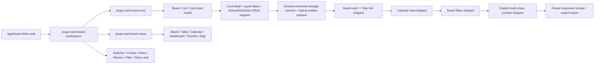

# Roadmap Manifest — xai-web-project-module

- Roadmap Source: `docs/reviews/xai-web-project-module/20260603-audit-and-prd.md`
- Source Code Reference: `apps/web/` + `packages/plugin-web-board-{core,views,workspaces}/` + `packages/plugin-project/`
- Init Path: manual follow-up queue from product audit
- Generated: 2026-06-03
- Default Automation Mode: D-Codex+Cursor
- Default Dependency Semantics: ready_to_ship
- Default Verify Cross-vendor: yes
- Wave Concurrency Cap: 2
- Authority: This manifest formalizes the Web Project/Board follow-up work. It does not reopen the shipped `xai-web-console` baseline; it creates new project-module improvement rows on top of the existing `/app/board` implementation.
- Current Route Truth: Web runtime currently exposes the module at `/app/board`. `/app/projects` is a planned alias/deep-link decision, not current code truth.

## Features

| # | Slug | Source | Depends On | Dep Semantics | Status | Priority | Note |
|---|------|--------|------------|---------------|--------|----------|------|
| 1 | xai-web-project-prd-sync | `docs/reviews/xai-web-project-module/20260603-audit-and-prd.md` | — | — | SHIPPED | P0 | Align Web PRD, PLUGIN_MAP, and product structure docs around `/app/board` vs formal Project naming. Shipped in `e79ecc5`. |
| 2 | xai-web-board-card-detail | same | xai-web-project-prd-sync | ready_to_ship | SHIPPED | P0 | Wire card click to detail modal/page with title, description, checklist, dates, labels, members, links, and activity notes. Shipped in `de9e120`. |
| 3 | xai-web-board-date-model | same | xai-web-project-prd-sync | ready_to_ship | SHIPPED | P0 | Replace display date strings with typed ISO fields and derived today/overdue labels across Board/Table/Calendar/Timeline/Dashboard. Shipped through `6661e51` plus ship docs/live smoke. |
| 4 | xai-web-board-list-crud | same | xai-web-board-card-detail | ready_to_ship | SHIPPED | P0 | Add rename, delete/archive, and reorder for lists. Shipped through `bd8066d` plus verify/live smoke. |
| 5 | xai-web-board-card-crud | same | xai-web-board-card-detail | ready_to_ship | SHIPPED | P0 | Add card rename, archive/delete, and within-list reorder; preserve stable ordering. Shipped through `b87d8de` plus verify/live smoke. |
| 6 | xai-web-board-checklist-editor | same | xai-web-board-card-detail | ready_to_ship | SHIPPED | P0 | Formalize card-detail checklist add/toggle/edit/remove, derived progress, and empty-list chip clearing. Shipped through `aeb4ee2` plus verify/live smoke. |
| 7 | xai-web-board-storage-contract | same | xai-web-board-date-model | ready_to_ship | SHIPPED | P0 | Define v1 envelope read/migration/write-preservation helpers for `xai_boards_v2` and lossless board/list/card logical entity projection. Shipped through `5dc2276` plus verify/live smoke. |
| 8 | xai-web-board-task-link | same | xai-web-board-storage-contract | ready_to_ship | SHIPPED | P1 | Link/create Task from Board card; surface linked task status in card detail. Shipped through `79a8bf3` plus verify/live smoke. |
| 9 | xai-web-board-calendar-feed | same | xai-web-board-date-model | ready_to_ship | SHIPPED | P1 | Feed active dated Board cards into Calendar Month/Week/Day without duplicating calendar data ownership. Shipped through `de4158e` plus verify/live smoke. |
| 10 | xai-web-board-saved-filters | same | xai-web-board-storage-contract | ready_to_ship | SHIPPED | P1 | Persist per-board filters and support clear/reset. Shipped through `dfe7fbd` plus verify/live smoke. |
| 11 | xai-web-board-share-contract | same | xai-web-board-storage-contract | ready_to_ship | SHIPPED | P1 | Visibly label mock share URL and emit explicit mock share-envelope fields. Shipped through `1806ee4` plus verify/live smoke. |
| 12 | xai-web-board-responsive-smoke | same | xai-web-board-card-detail, xai-web-board-date-model | ready_to_ship | PENDING | P1 | Verify Board/Table/Calendar/Timeline/Detail on desktop and mobile widths. |
| 13 | xai-web-board-export-import | same | xai-web-board-storage-contract | ready_to_ship | PENDING | P1 | Add board logical entities to export/import/delete flows. |
| 14 | xai-web-board-automation-lite | same | xai-web-board-card-detail, xai-web-board-date-model | shipped | PENDING | P2 | Preset rules only: Done completion, due-soon urgent label, daily due sort. |
| 15 | xai-web-board-integrations | same | xai-web-board-share-contract | ready_to_ship | PENDING | P2 | Adapter plan for Google Calendar, GitHub/Linear, Drive/link attachments. |
| 16 | xai-web-board-comments-activity | same | xai-web-board-card-detail | ready_to_ship | PENDING | P2 | Add comments and activity log; mention notifications remain future collaboration work. |
| 17 | xai-web-board-permissions | same | xai-web-board-share-contract | ready_to_ship | PENDING | P2 | Private/shared board states and future workspace permissions. |

## Personal Development Board Mapping

This file is the current source-backed personal development board for the Web Project module in this worktree. Do not edit generated dashboard snapshots directly.

| Board List | Cards |
|---|---|
| Shipped | `xai-web-project-prd-sync`, `xai-web-board-card-detail`, `xai-web-board-date-model`, `xai-web-board-list-crud`, `xai-web-board-card-crud`, `xai-web-board-checklist-editor`, `xai-web-board-storage-contract`, `xai-web-board-task-link`, `xai-web-board-calendar-feed`, `xai-web-board-saved-filters`, `xai-web-board-share-contract` |
| This Week | `xai-web-board-responsive-smoke` |
| Backlog | — |
| Waiting | `xai-web-board-export-import` waits on export/delete/privacy ownership. |
| Later | `xai-web-board-automation-lite`, `xai-web-board-integrations`, `xai-web-board-comments-activity`, `xai-web-board-permissions` |

## Product Structure



## Run Guidance

Use `/xai-feature-full-loop` for one row at a time until this manifest is promoted to a normal roadmap-loop run. Start with row #2 only after row #1 docs are accepted.

Suggested first execution prompt:

```text
/xai-feature-full-loop
Feature: xai-web-board-card-detail
Automation Mode: D-Codex+Cursor
Verify Cross-vendor: yes
Requirement: Implement the P0 card detail row from docs/workflow/roadmap/xai-web-project-module.md and docs/reviews/xai-web-project-module/20260603-audit-and-prd.md.
```
